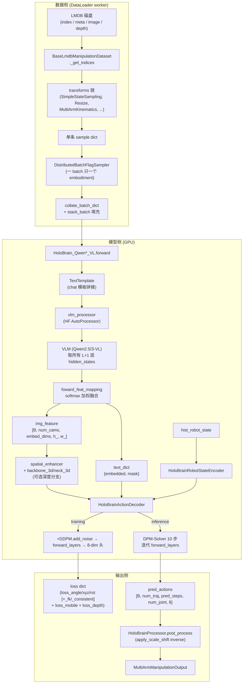

# 01 · 项目总览

> **阅读前置**：无
>
> **本章目标**：用 10 分钟建立对 HoloBrain 的"整机视图"——它是什么、为什么这样设计、一次前向从头到尾发生了什么。

---

## 1.1 一句话说明

**HoloBrain 是一个通用具身操控（generalist manipulation）策略模型**，把预训练视觉语言模型（Qwen2.5-VL / Qwen3-VL）作为"感知/语言"主干、把**扩散动作解码器**（DDPM 训练 + DPM-Solver 推理，`prediction_type="sample"` 直接预测干净轨迹 x₀）作为"动作生成"头，在同一份权重里同时支持约 20 个数据集/仿真平台（LIBERO、RoboTwin2.0、AgiBot、RoboCasa、Isaac、Behavior-1K、真实双臂机器人 …）与多种末端形态（单臂、双臂、移动底盘、多关节手指）。

它的核心思路可以概括为四点：

1. **VLM 提供多层特征**——预训练 VLM（默认冻结或部分冻结）的 **每一层 hidden state** 都取出来，用一组可学习的线性映射 + softmax 权重进行融合（`foward_feat_mapping`）。相当于让下游动作头自己决定哪一层的"表征深度"最有用。
2. **动作作为一段 chunk-of-tokens**——把 `pred_steps` 个未来动作按 `chunk_size` 切分成 `num_chunk` 组，每一组视为 `num_joint` 个"关节 token"。
3. **在扩散 loop 里让动作 token 反复与视觉/语言/历史状态交叉注意力**——同一个 Transformer stack（`operation_order`）在 10 步 DPM-Solver 采样中被重复调用。视觉、文本、历史状态各自作为 KV 分支；`MultiModalAttention` 用一个软路由把三个分支加权融合。
4. **只归一化"关节角度"这一个通道**——动作被表示为 8 维 `[jval, x, y, z, qw, qx, qy, qz]`；通道 0 的 `jval` 用 per-joint `(scale, shift)` 仿射到大致零均值单方差，`(x, y, z, quat)` 用正向运动学（`pytorch_kinematics`）在数据侧就地算出，保持物理意义不动。

## 1.2 解决什么问题

传统单任务操控策略的痛点：

- 每换一个数据集/机器人就要重训一个模型；
- 语言指令与视觉观测的融合往往是浅层 CLIP-like 特征，无法利用大 VLM 的常识；
- 动作预测常常是"单步回归"，长时序稳定性差；
- 每个 embodiment 的关节数量、坐标系约定都不同，模型结构难以一次覆盖。

HoloBrain 的应对：

| 痛点 | HoloBrain 做法 | 相关代码 |
|------|----------------|----------|
| 多 embodiment | `DistributedBatchFlagSampler` 保证一个 batch 只含一个 embodiment，关节数按 `joint_mask + joint_relative_pos` 显式建模 | `robo_orchard_lab/dataset/dataset_wrapper.py:49`；`transforms.py: MultiArmKinematics` |
| 语言/视觉融合浅 | 直接接 Qwen VLM 的**每一层** hidden state，softmax 融合 | `robo_orchard_lab/models/holobrain/structure.py:276-290` |
| 长时序 | 一次预测 `pred_steps=64` 步动作，扩散 + `parallel_loss_weight` 的多轨迹"winner-takes-all"训练 | `action_decoder.py:480-592`；`loss.py:191-204` |
| 关节数不同 | 关节维度用 URDF 计算的 **图上相对距离** `joint_relative_pos` 作为位置偏置，而不是绝对索引 | `layers.py: JointGraphAttention`；`horizon_manipulation/transforms.py: MultiArmKinematics` |

## 1.3 端到端数据流（Mermaid）

## 1.4 支持的 embodiment / 数据集

来源：`projects/holobrain_internal/common/configs/dataset_specs.py:43`（`TRAINING_DATASETS`）与 `deploy_specs.py`（`DEPLOY_DATASETS`）。

| 家族 | 主要来源 | 关节形态 | 备注 |
|------|----------|----------|------|
| **LIBERO** / LIBERO-Plus | LIBERO 官方数据 4 个 suite（goal/object/spatial/10） | 单臂 Franka + 单夹爪 | 直接给 EE state |
| **RoboTwin 2.0 / 1.0** | RoboTwin 仿真 | 双臂：Aloha v1/v2、UR5-WSG、ARX X5A、Franka Panda、Piper | 每个 embodiment 一份 URDF + `scale_shift` |
| **AgiBot** | 内部真实数据 | 双臂 7+1+7+1 + 头 + 身体 = 20 关节 | 训练时下采样 3 帧再插值 |
| **AgiBot Digit / GenieSim3** | 数字/仿真双子 | 与真机对齐 | GenieSim3 challenge |
| **Agilex** | 内部真实数据 | Piper × 三个站点（BJ/SH low/high） | 支持 `truncated_subtask` |
| **Table30v2** | 桌面场景 | UR5、ARX5、Aloha、DOS-W1 | |
| **DROID / RH20T / EgoDex / ABC-130k** | 公开真实/半合成 | 单臂或人手 | |
| **Interna1** | 内部 | ARX-Lift2 / Agile-Split-Aloha | |
| **Isaac** | Orchard Isaac Sim | dualarm Piper | 桌面操控子任务 |
| **Behavior-1K** | OmniGibson | 长程移动 + 操控 | 有 mobile trajectory 分支 |
| **RoboCasa** | RoboCasa 仿真 | 单臂 | pretrain / mimicgen / target |
| **RoboDojo** | 内部 | | 见 `config_robodojo_dataset.py` |

`filter_list`（`dataset_specs.py:612`）显式白名单当前实际启用的数据集；不在白名单的暂时不会加载。

## 1.5 关键设计取舍（读源码前要知道的几点）

1. **VLM 通常被冻结或部分冻结**。`freeze_vlm=True` 时 `self.vlm.eval(); requires_grad_(False)`（`structure.py:159-161`）；只训练映射层 `feat_mapping` + `weight` + 下游 decoder。这解释了为什么显存能塞下 3B 级别的 VLM。
2. **动作解码器是 DDPM 扩散**，但训练时随机采一步 `t`、`prediction_type="sample"` 直接回归 x₀；推理时用 **DPM-Solver 只跑 10 步**（`num_inference_timesteps=10`，`action_decoder.py:657-693`）。所以从算力/延迟角度它比标准 DDPM 快很多。
3. **动作是 chunk 化的**：把 `pred_steps=64` 切成 `num_chunk = 64 // chunk_size = 16` 个 chunk，每个 chunk 内 4 步作为一个 token。这让 attention 序列长度从 `T × J` 降到 `T/chunk × J`。head 部分再用 `UpsampleHead` 把时序上采样回 `pred_steps`。
4. **"CFG"式的条件 dropout**只作用在 **proprioception**（历史关节状态）与 **temporal history keys** 上，不作用在语言 token：
   - `MultiModalAttention.state_drop_rate=0.2`（`layers.py:530-536`）
   - `temporal_attn_drop=0.05`（`action_decoder.py:851-855`）
5. **规范化只对"关节角度"这一个通道**。`x/y/z/quat` 由 FK 计算，保留物理量纲，不做 scale-shift。
6. **一个 batch 只含一个 embodiment**（`DistributedBatchFlagSampler`）。所以 `num_joint` 在每个 batch 内是常数，`num_cams` 也是常数。跨 batch 的差异靠 `joint_mask` 与 `joint_relative_pos` 让同一份权重通用。

## 1.6 相关论文/方法（背景）

> **待确认**：仓库内没有明确指向某篇公开论文的引用；命名与结构提示混合了以下几支线索：
>
> - **VLA (Vision-Language-Action)** 风格：使用大 VLM 作 backbone，如 RT-2、OpenVLA 系列的思路。
> - **Diffusion Policy / RDT / π0 系列**：动作用扩散建模，`chunk` + `UpsampleHead` 与 π0 的动作 chunk 化理念相近。
> - **DiT (Diffusion Transformer)** 结构：`AdaRMSNorm(zero=True)` 输出 `(scale, shift, gate_msa, shift_mlp, scale_mlp, gate_mlp)` 六元组正是 DiT 的 adaLN 调制方案（`layers.py:609-670`）。
> - **多层特征软融合**：类似 Perceiver-IO / ELM 的 layer-wise soft-mixing。
>
> 因此可以把 HoloBrain 视为 **"VLA + Diffusion Transformer + 多层特征软融合 + 关节图注意力"** 的一次内部整合实现。

---

**下一篇 →** [02_repo_structure.md](./02_repo_structure.md)
