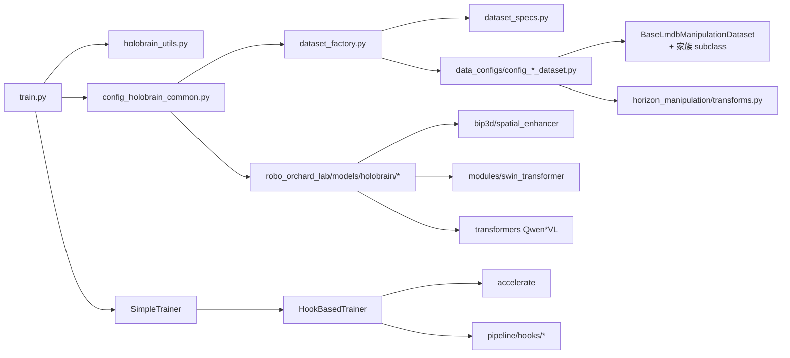

# 02 · 仓库结构导览

> **阅读前置**：[01_overview](./01_overview.md)
>
> **本章目标**：一次性搞清"哪个目录/文件干什么"，并给出**照着读第一遍源码的推荐顺序**。

---

## 2.1 项目侧目录：`projects/holobrain_internal/common/`

```
common/
├── README.md                        # 内部资源与命令行速查
├── train.py                         # ★ 训练入口（Accelerate + SimpleTrainer）
├── export.py                        # ★ 导出 processor + safetensors + inference.config
├── holobrain_utils.py               # load_config / load_checkpoint / ActionMetric / 可视化基类
├── configs/                         # ★ 全部配置（三份主 config + 每个数据集的 config + specs）
│   ├── config_holobrain_common.py       # 主训练配置（Qwen VLM + Diffusion decoder）
│   ├── config_holobrain_gd_common.py    # GroundingDINO backbone 变体
│   ├── config_holobrain_value_common.py # value model 训练配置
│   ├── dataset_factory.py               # 三个注册字典 + 顶层 build_* 函数
│   ├── dataset_specs.py                 # TRAINING_DATASETS 列表 + filter_list 白名单
│   ├── deploy_specs.py                  # DEPLOY_DATASETS：仅用于 export processor
│   └── data_configs/                    # 每个 embodiment 家族一份 config
│       ├── config_libero_dataset.py
│       ├── config_robotwin_dataset.py
│       ├── config_agibot_dataset.py
│       ├── config_agibot_geniesim_dataset.py
│       ├── config_agibot_digit_dataset.py
│       ├── config_agilex_dataset.py
│       ├── config_agilex_ro_dataset.py
│       ├── config_behavior_dataset.py
│       ├── config_droid_dataset.py
│       ├── config_egodex_dataset.py
│       ├── config_interna1_dataset.py
│       ├── config_isaac_dataset.py
│       ├── config_rh20t_dataset.py
│       ├── config_robocasa_dataset.py
│       ├── config_robodojo_dataset.py
│       ├── config_robotwin_dataset.py
│       ├── config_table30_ro_dataset.py
│       ├── config_table30v2_dataset.py
│       └── config_abc130k_dataset.py
├── data_visualize/                  # 数据可视化（离线 mp4 与在线 Flask web app）
│   ├── video.py
│   ├── app.py
│   └── index.html
├── aidi_submit_config/              # AIDI 集群作业 json
│   ├── submit_cfg.json                  # 主训练
│   ├── submit_cfg_value_model.json      # value 模型训练
│   ├── submit_cfg_libero_eval.json
│   ├── submit_cfg_libero_plus_eval.json
│   ├── submit_cfg_robotwin_eval.json
│   ├── submit_cfg_robocasa_eval.json
│   ├── submit_cfg_isaac_eval.json
│   ├── submit_cfg_behavior1k_eval.json
│   └── submit_cfg_geniesim3_eval.json
├── isaac_task_config/               # Isaac Lab 多任务 YAML
├── libero_eval.py                   # 各评估脚本（详见 09 章）
├── robotwin_eval.py
├── robocasa_eval.py
├── isaac_eval.py
├── behavior1k_eval.py
├── realworld_eval.py                # Flask WSGI 真机推理服务
├── robochallenge_eval.py
├── geniesim3_inference_server.py    # asyncio WebSocket 推理服务
├── holobrain_behavior1k_policy/     # 每种评估 harness 的 policy 适配层
├── holobrain_geniesim3_policy/
├── holobrain_libero_policy/
├── holobrain_robocasa_policy/
├── holobrain_robochallenge_policy/
├── holobrain_robotwin_policy/
├── ckpt   → /horizon-bucket/robot_lab/users/xuewu.lin/ckpt        # 软链
├── data   → /horizon-bucket/robot_lab2/datasets/all_data          # 软链
└── urdf   → /horizon-bucket/robot_lab2/datasets/all_data/urdf/... # 软链
```

## 2.2 库侧目录：`robo_orchard_lab/models/holobrain/`

```
robo_orchard_lab/models/holobrain/
├── __init__.py                # ★ 公开 API：导出所有 config + 模型 + 层
├── structure.py               # ★ HoloBrain_Qwen2_5_VL + TextTemplate（Qwen2.5-VL 版）
├── structure_qwen3_5.py       # HoloBrain_Qwen3_5_VL（Qwen3.5 版，改冻结策略与 patch_size）
├── structure_qwen3_vl.py      # HoloBrain_Qwen3VL（Qwen3-VL 版，patch_size=32，用 KV cache 作 hidden state）
├── action_decoder.py          # ★ 扩散动作解码器（1098 行，核心中的核心）
├── robot_state_encoder.py     # 历史状态 encoder（joint × time 双向 attn）
├── layers.py                  # ★ 通用层：RotaryAttention/JointGraph/AdaRMSNorm/UpsampleHead/MultiModalAttention …
├── loss.py                    # ★ HoloBrainActionLoss：angle/xyz/rot [+_fk/_consistent] + mobile
├── processor.py               # HoloBrainProcessor（数据结构 <-> dict）
├── pipeline.py                # HoloBrainInferencePipeline（processor + model 组合）
└── utils.py                   # apply_scale_shift / forward_kinematics / recompute / apply_joint_mask
```

## 2.3 其他强相关库目录

```
robo_orchard_lab/
├── dataset/
│   ├── collates.py                       # collate_batch_dict
│   ├── dataset_wrapper.py                # ConcatDatasetWithFlag / DistributedBatchFlagSampler / DistributedMixedBatchFlagSampler
│   ├── lmdb/
│   │   ├── base_lmdb_dataset.py          # BaseLmdbManipulationDataset + BaseIndexData + StepLevelTags
│   │   └── lmdb_wrapper.py               # mmap 读 LMDB
│   ├── libero/                           # LiberoLmdbDataset + libero 专用 transforms
│   ├── robotwin/                         # RoboTwinLmdbDataset + robotwin 专用 transforms
│   ├── agibot/                           # AgiBotLmdbDataset + compute_joint_statistics.py 等
│   ├── horizon_manipulation/             # 共享 transforms（MultiArmKinematics、SimpleStateSampling、Resize …）
│   └── ...
├── pipeline/
│   ├── trainer.py                        # SimpleTrainer（现在标 @deprecated，转发给 HookBasedTrainer）
│   ├── hook_based_trainer.py             # HookBasedTrainer（真正的训练器）
│   ├── batch_processor/simple.py         # SimpleBatchProcessor 基类
│   └── hooks/
│       ├── stats.py                      # StatsMonitorConfig
│       ├── checkpoint.py                 # SaveCheckpointConfig
│       ├── grad_clip.py                  # GradientClippingHookConfig
│       ├── optimizer.py                  # OptimizerHookConfig
│       └── validation.py                 # ValidationHookConfig
├── models/
│   ├── bip3d/                            # 3D 特征增强（DepthFusionSpatialEnhancer 等）
│   ├── layers/                           # 通用 transformer layers（FFN 等）
│   ├── mixin.py                          # ModelMixin：save_model/load_model 骨架
│   └── modules/swin_transformer.py       # depth backbone
├── utils/build.py                        # 支持 dict(type=Class, ...) 的 build() 工具
└── inference/basic.py                    # InferencePipeline 基类
```

## 2.4 三条软链的含义

```
common/data  → /horizon-bucket/robot_lab2/datasets/all_data
common/urdf  → /horizon-bucket/robot_lab2/datasets/all_data/urdf/urdf_v20260711
common/ckpt  → /horizon-bucket/robot_lab/users/xuewu.lin/ckpt
```

- **data**：所有数据集 LMDB / parquet 的实际路径。`dataset_specs.py` 里 `DATA_BASE = os.environ.get("HOLOBRAIN_DATA_BASE", "./data")` 决定去哪里找；默认走软链。
- **urdf**：每种机器人 URDF 与相关网格文件。`config_*_dataset.py` 里 `kinematics_config["urdf"]` 都写成 `"./urdf/<family>/.../*.urdf"`。
- **ckpt**：预训练 VLM、GD backbone、HoloBrain 各版本 safetensors 存放处。

如果本地没这三个 bucket，请按 [03 章](./03_env_and_quickstart.md) 建立同名软链或改 `HOLOBRAIN_DATA_BASE`、`vlm_pretrain`、`checkpoint` 配置。

## 2.5 推荐的代码阅读顺序（★ 是必读，◇ 是选读）

> 目标：一天以内建立"能读能改"的能力。

1. ★ `projects/holobrain_internal/common/README.md`——命令行速览。
2. ★ `projects/holobrain_internal/common/configs/config_holobrain_common.py`——完整体会一份 config 的形状。
3. ★ `projects/holobrain_internal/common/train.py`——训练入口串起了 config / dataset / model / trainer / hooks。
4. ★ `projects/holobrain_internal/common/configs/dataset_factory.py`——理解注册器机制。
5. ★ 选一个 embodiment 精读：`configs/data_configs/config_libero_dataset.py`（结构最简单）。
6. ★ `robo_orchard_lab/dataset/libero/libero_lmdb_dataset.py`——看 `__getitem__` 一条样本怎么读。
7. ★ `robo_orchard_lab/dataset/horizon_manipulation/transforms.py`——搜 `MultiArmKinematics / SimpleStateSampling / GetProjectionMat / Resize`。
8. ★ `robo_orchard_lab/models/holobrain/structure.py`——看 `HoloBrain_Qwen2_5_VL._forward`。
9. ★ `robo_orchard_lab/models/holobrain/action_decoder.py`：先 `forward` 里 training 分支，再 `forward_layers`。
10. ★ `robo_orchard_lab/models/holobrain/loss.py`。
11. ★ `robo_orchard_lab/models/holobrain/layers.py`——`RotaryAttention / JointGraphAttention / MultiModalAttention / AdaRMSNorm / UpsampleHead` 五个类是复用面最大的。
12. ◇ `robo_orchard_lab/models/holobrain/robot_state_encoder.py`——`HoloBrainRobotStateEncoder`。
13. ◇ `robo_orchard_lab/pipeline/hook_based_trainer.py`——`SimpleTrainer` 的底层实现。
14. ◇ `projects/holobrain_internal/common/export.py`。
15. ◇ 任一 eval 脚本（推荐 `libero_eval.py` 或 `realworld_eval.py`）。

**每一步不要"读完"，而是"读到能回答一个问题"**。例如读 (3) train.py 时问自己：`accelerator.prepare(...)` 在哪里被调？找到答案在 `HookBasedTrainer.__init__` 后立刻回到 train.py 继续。

## 2.6 高层依赖关系（简化 Mermaid）



---

**下一篇 →** [03_env_and_quickstart.md](./03_env_and_quickstart.md)
