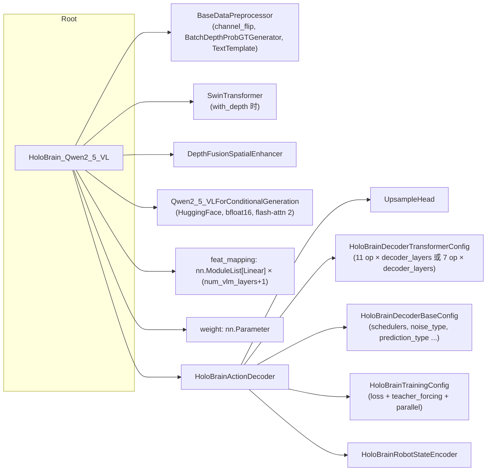

# 04 · 配置系统

> **阅读前置**：[02_repo_structure](./02_repo_structure.md)、[03_env_and_quickstart](./03_env_and_quickstart.md)
>
> **本章目标**：搞清 HoloBrain 的 "**配置文件即 Python 模块**" 机制，学会读 `config_holobrain_common.py`，能加/删/换数据集。

---

## 4.1 配置文件的形状

HoloBrain **不用 Hydra、不用 OmegaConf、不用 MMEngine Registry**。它的配置系统是最朴素的一种：**每一份 config 就是一个 Python 模块**，被 `holobrain_utils.load_config` 用 `importlib.util.spec_from_file_location` 动态加载（`holobrain_utils.py:72-80`）。

一份合规的配置模块必须在**模块级**提供以下 6 个符号：

| 符号 | 类型 | 作用 |
|------|------|------|
| `config` | `dict` | 全部超参 / 开关 |
| `build_model(config)` | 函数 | 返回一个 `nn.Module` |
| `build_optimizer(config, model)` | 函数 | 返回 `(optimizer, lr_scheduler)` |
| `build_training_dataset(config, lazy_init=False)` | 函数 | 返回一个 `Dataset`；一般转发给 `dataset_factory` |
| `build_validation_dataset(config, lazy_init=False)` | 函数 | 返回 `Dataset` 或 `None` |
| `build_processors(config)` | 函数 | 返回 `{dataset_name: HoloBrainProcessor}` |

`train.py:70-76`：

```python
config = load_config(args.config)         # 动态 import 一整个 .py 模块
build_model = config.build_model
build_dataset = config.build_training_dataset
build_validation_dataset = config.build_validation_dataset
build_optimizer = config.build_optimizer
build_processors = config.build_processors
config = config.config                    # 覆盖为 dict，后面按 dict 用
```

## 4.2 `config_holobrain_common.py` 拆解

来源：`projects/holobrain_internal/common/configs/config_holobrain_common.py:18-93`。分成 8 组解读：

### 序列 / chunk

| 字段 | 默认 | 含义 |
|------|------|------|
| `hist_steps` | 1 | 历史观测步数（`hist_robot_state` 的 T 维） |
| `pred_steps` | 64 | 预测动作步数（`pred_robot_state` 的 T 维） |
| `chunk_size` | 4 | 每个动作 token 打包多少步；`num_chunk = pred_steps // chunk_size = 16` |
| `embed_dims` | 256（v9 覆盖为 **384**） | 全网络主 hidden 宽度 |

### 深度分支

| 字段 | 默认 | 含义 |
|------|------|------|
| `with_depth` | True | 是否启用 depth backbone (Swin) + `DepthFusionSpatialEnhancer` |
| `with_depth_loss` | True | 是否加 depth 概率分布 loss |
| `min_depth / max_depth / num_depth` | 0.01 / 1.2 / 128 | depth 分档 |

### 训练循环

| 字段 | 默认 | 含义 |
|------|------|------|
| `batch_size` | 16 | 每 GPU |
| `max_step` | `1e5` | 训练总 step |
| `step_log_freq` | 50 | `StatsMonitor / LossMovingAverageTracker` 的打印频率 |
| `save_step_freq` | 5000 | `SaveCheckpointConfig` 保存频率；同时也是 `step_eval_freq` |
| `num_workers` | 16 | DataLoader worker |
| `lr` | 1e-4 | AdamW base lr（VLM 组会自动 ×0.1） |

### Prompt / 任务

| 字段 | 默认 | 含义 |
|------|------|------|
| `training_with_subtask` | False | 是否把 subtask label 拼进 chat prompt |
| `with_cot` | False | 是否用 chain-of-thought 生成，`_generate_vlm` 走自回归 |

### 数据集引用

| 字段 | 默认 | 含义 |
|------|------|------|
| `dataset_specs` | `"dataset_specs"` | Python 模块名，`_load_module_from_ref` 会 import 它并读 `training_datasets` |
| `deploy_specs` | `"deploy_specs"` | 类似，读 `deploy_datasets` |

### VLM

| 字段 | 默认 | 含义 |
|------|------|------|
| `vlm_pretrain` | `"./ckpt/Qwen2.5-VL-3B-Instruct"` | 本地 VLM 权重目录 |
| `num_vlm_layers` | 1（v9 覆盖为 **4**） | 只保留 VLM 前 N 层 transformer，其余截断；`None` 表示保留全部 |
| `freeze_vlm` | False | 是否冻结 VLM |

### Checkpoint

| 字段 | 默认 | 含义 |
|------|------|------|
| `checkpoint` | `"./ckpt/HoloBrain_v0.0_Qwen/model.safetensors"`（v9 覆盖为一个 http URL） | 训练开始前 `load_checkpoint(strict=False)` 加载的权重 |

### v9 版本覆盖（`config_holobrain_common.py:84-93`）

```python
config.update(
    num_vlm_layers=4,
    embed_dims=384,
    decoder_layers=10,
    checkpoint="http://.../holobrain_v9_newinit_.../checkpoint_50/model.safetensors",
    multi_modal_attn=True,
)
```

**这些覆盖是"最新可用"的实验配置**。如果只是想跑 baseline，把这一段注释掉、保留前面的 v0 checkpoint 即可。

## 4.3 `build_model` 里的 `dict(type=Class, ...)` 注册器 pattern

HoloBrain 用一个自研的轻量 `build` 工具（`robo_orchard_lab/utils/build.py`）代替 mmengine registry。规则很简单：**一个 dict 若含 `type=SomeClass`，会被递归展开成 `SomeClass(**其余字段)`**；里面嵌套的 dict 同样递归展开。

`config_holobrain_common.py:163-173` 就是一个典型例子：

```python
head = dict(
    type=UpsampleHead,
    upsample_sizes=[num_chunk * 2, config["pred_steps"]],
    input_dim=embed_dims,
    dims=[128, 64],
    norm=dict(type=decoder_norm, normalized_shape=embed_dims),
    act=dict(type=nn.SiLU, inplace=True),
    norm_act_idx=[0, 1],
    num_output_layers=2,
    out_dim=state_dims,
)
```

到了 `HoloBrainActionDecoder.__init__` 里，被 `build(head)` 一行还原成一个真实的 `UpsampleHead` 实例。

这就是为什么改结构（换 norm、加层、换 attn）大多数时候只要**改 config dict**、不用改代码。

### 完整对象树（简化 Mermaid）



## 4.4 `operation_order`：Decoder 的"指令序列"

`config_holobrain_common.py:191-215`：

```python
multi_modal_attn = config.get("multi_modal_attn", False)
if not multi_modal_attn:
    decoder_operation_order = [
        "t_norm", "temp_joint_attn", "gate_msa",
        "norm", "img_cross_attn",
        "norm", "text_cross_attn",
        "norm", "scale_shift", "ffn", "gate_mlp",
    ] * decoder_layers
else:
    decoder_operation_order = [
        "t_norm", "multi_modal_attn", "gate_msa",
        "norm", "scale_shift", "ffn", "gate_mlp",
    ] * decoder_layers
```

两种模式：
- **不启用 multi_modal_attn**（默认）：一个 decoder block 内串行做「temp_joint_attn → img cross-attn → text cross-attn → FFN」，共 11 个 op。
- **启用 multi_modal_attn**（v9 已启用）：把 img/text/temp-joint 三路 attention 合并到一个 `MultiModalAttention`，用软路由加权融合，共 7 个 op。

想加/删 op（比如再加一次 image cross-attn），只要改这个 list。

## 4.5 三份 config 对比

| 文件 | 变体 | 何时用 |
|------|------|--------|
| `config_holobrain_common.py` | 主配置：Qwen*VL backbone + 扩散 decoder | 常规训练；除非有特殊需求 |
| `config_holobrain_gd_common.py` | 用 GroundingDINO 风格 backbone（BERT + Swin + `TextImageDeformable2DEnhancer`）套同一个 `HoloBrainActionDecoder` | 更轻量、更显式的 grounding；`batch_size=8, num_workers=8, dst_wh=(320, 256), patch_size=64` |
| `config_holobrain_value_common.py` | value model：`HoloBrain_Value_Qwen2_5_VL / HoloBrainValueDecoder / HoloBrainValueLoss` | 训练一个值函数网络（`value_norm_mode="episode", output_dim=51, loss_mode="hlgauss"`）；用于 offline eval 或作为策略输入的辅助信号 |

## 4.6 `dataset_factory.py`：注册与组合

来源：`projects/holobrain_internal/common/configs/dataset_factory.py`。

### 三张注册表（`dataset_factory.py:30-32`）

```python
TRAIN_DATASET_BUILD_FUNCS: dict[str, Callable] = {}
VALIDATION_DATASET_BUILD_FUNCS: dict[str, Callable] = {}
PROCESSOR_BUILD_FUNCS: dict[str, Callable] = {}
```

**装饰器**用法（在每个 `data_configs/config_*_dataset.py` 底部）：

```python
@train_dataset_register("libero")
def build_datasets(config, dataset_name, data_paths, mode="training", lazy_init=True):
    ...
```

`apply_dataset_register()`（`dataset_factory.py:58-66`）在第一次 build 前一次性 `importlib.import_module("data_configs")`——`data_configs/__init__.py` 里 `from .config_libero_dataset import *`, `from .config_robotwin_dataset import *`, … 会把所有装饰器都跑起来，注册表就填满了。

### 三个顶层函数

- `build_training_dataset(config, lazy_init=False)`（`dataset_factory.py:199-233`）：
  1. `apply_dataset_register()` 触发一次性注册。
  2. 从 `dataset_specs` 模块读 `training_datasets` 列表。
  3. 遍历每条 spec：把 `sample_weight`（若有）提到 `dataset_sample_weights` 字典里；再按 `dataset_type` 找到注册的 build 函数并调用。
  4. 用 `ConcatDatasetWithFlag(datasets=[...])` 包起来返回。
  5. `_finalize_dataset_sample_weights` 把 dict 按 `dataset_names` 重排成 list，塞回 `config["dataset_sample_weights"]` 供 sampler 使用。
- `build_validation_dataset(config, lazy_init=False)`（`dataset_factory.py:236-256`）：读 `validation_datasets`；若为 `None` 返回 `None`。
- `build_processors(config)`（`dataset_factory.py:259-280`）：读 `deploy_specs.py::deploy_datasets`；返回 `{dataset_name: HoloBrainProcessor}` 字典。

### 一个 embodiment 的 config 长什么样

以 `data_configs/config_libero_dataset.py` 为例：

```python
DATA_TYPE = "libero"

def build_transforms(config, mode):
    return [                      # 一串 dict(type=..., ...)
        dict(type=AddItems, ...),
        dict(type=SimpleStateSampling, ...),
        dict(type=Resize, dst_wh=(308, 252)),
        dict(type=ImageChannelFlip, output_channel=[2,1,0]),
        dict(type=ToTensor),
        dict(type=GetProjectionMat, target_coordinate="ego"),
        dict(type=TransformRobotState, ...),
        dict(type=ConvertDataType, ...),
        dict(type=ItemSelection, keys=[...]),
    ]

@train_dataset_register("libero")
def build_datasets(config, dataset_name, data_paths, mode="training", lazy_init=True):
    transforms_ = build_transforms(config, mode)
    return LiberoLmdbDataset(
        paths=data_paths, transforms=transforms_,
        cam_names=cam_names, dataset_name=dataset_name,
        flag=int(uuid.uuid5(uuid.NAMESPACE_DNS, "libero").hex[:4], 16),
    )

@processor_register("libero")
def build_processors(config, dataset_name, **kwargs):
    return HoloBrainProcessor(HoloBrainProcessorCfg(
        load_image=True, load_depth=config["with_depth"],
        transforms=build_transforms(config, "deploy"),
        cam_names=cam_names,
    ))
```

各家族的差异集中在：
- `cam_names`、`T_base2ego`、`ee_frame_alignment`、`joint_scale_shift`、`joint_relative_pos`、`loss_weights`（LIBERO）；
- `kinematics_config`（RoboTwin / AgiBot：URDF 与关节链）；
- `data_paths` 有些是**lambda**，训练启动时通过 `_glob_sorted` 动态展开。

## 4.7 `dataset_specs.py`：清单

来源：`projects/holobrain_internal/common/configs/dataset_specs.py`。

- **`DATA_BASE = os.environ.get("HOLOBRAIN_DATA_BASE", "./data")`**（第 23 行）——决定去哪找 LMDB。
- **`_glob_sorted(*patterns, exclude_patterns=None)`**（第 26–40 行）——供某些 `data_paths` lambda 使用（如 shard 数量不确定时）。
- **`TRAINING_DATASETS`**（第 43 行起）——每一条是 `dict(dataset_type=..., dataset_name=..., setting_type=..., data_paths=[...] or lambda, ...)`。可选字段：`instruction_paths / instruction_path / reference_img_path / load_extrinsic / truncated_subtask / mimicgen / mobile / adc_anno_results_dir / sample_weight`。
- **`VALIDATION_DATASETS = None`**（第 607 行）——目前项目内无验证集。
- **`filter_list`**（第 612 行）——一个显式的**白名单列表**，只有列表中的 dataset_name 会出现在最终 `training_datasets` 里。想临时禁用某个数据集，注释掉这里就行。
- **`dataset_sample_weights`**（第 661 行）——旧的字典式采样权重；新写法推荐直接在 spec 里加 `sample_weight=` 字段（见 `config_holobrain_common.py:47-64` 注释）。
- **`use_dataset_sample_weights = False`**（第 706 行附近）——启用旧字典。

## 4.8 `deploy_specs.py`：仅用于导出 processor

结构与 `dataset_specs.py` 类似，但 **不含 `data_paths`**——因为部署只需要"处理器"和"pipeline json"，不需要实际数据。

导出时 `export.py`（或 `train.py` 主进程）会把每一条 `DEPLOY_DATASETS` 转成两个文件：
- `<dataset_name>_processor.json`
- `<dataset_name>_inference.config.json`

这样一个 exported model 目录里可以同时挂多种 embodiment 的推理配置，供 [09 章](./09_export_and_eval.md) 的 eval 脚本用 `--model_processor` 挑选。

## 4.9 实验修改 Checklist

按最常见的四种改动整理：

### (A) 只想改超参（batch/lr/max_step）

- 首选：命令行 `--kwargs '{"batch_size":8,"max_step":50000}'`；
- 次选：在 config 底部加一行 `config.update(batch_size=8, ...)`。

### (B) 只想训练某个数据集

- 在 `dataset_specs.py::filter_list` 里只保留你要的 `dataset_name`；
- 或者在 config 里加 `config.update(training_datasets=["libero_goal"])` 覆盖。

### (C) 增加一个新数据集

1. 在 `data_configs/` 下加 `config_<name>_dataset.py`，写 `build_transforms / build_datasets(@train_dataset_register) / build_processors(@processor_register)`。
2. 在 `data_configs/__init__.py` 里加一行 `from .config_<name>_dataset import *`。
3. 在 `dataset_specs.py::TRAINING_DATASETS` 里加对应 spec dict，并把 `dataset_name` 加入 `filter_list`。
4. 若需要导出该 embodiment：在 `deploy_specs.py::DEPLOY_DATASETS` 里加一条。
5. 训练前用 `python3 data_visualize/video.py --config configs/config_holobrain_common.py --dataset_names <name>` 视觉核对。

### (D) 换 VLM

- 改 `config["vlm_pretrain"]`。
- 如果路径里包含 `"qwen3.5"` 或 `"qwen3_5"`，`build_model` 自动切到 `HoloBrain_Qwen3_5_VL`（`config_holobrain_common.py:149-156`）；用 Qwen3-VL 则参考 `structure_qwen3_vl.py`，可能需要自己写一份新 `config`。
- 记得 `patch_size` 与 VLM 相匹配（`config_holobrain_common.py:150 / 154`；Qwen3-VL 强制为 32）。

---

**下一篇 →** [05_dataset_pipeline.md](./05_dataset_pipeline.md)
