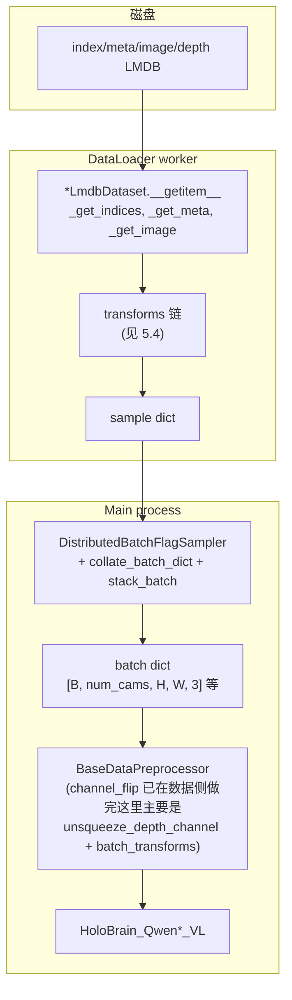

# 05 · 数据 Pipeline

> **阅读前置**：[04_config_system](./04_config_system.md)
>
> **本章目标**：把"磁盘 LMDB → 一条 sample → 一个 batch dict"整条链路走一遍；能读懂每一个 transform 的作用与 shape 变化。

---

## 5.1 磁盘布局：4 子 LMDB

HoloBrain 主力用一种**自定义 LMDB layout**（不是 LeRobot，不是 HuggingFace datasets）。基类是
`robo_orchard_lab/dataset/lmdb/base_lmdb_dataset.py:185`：`BaseLmdbManipulationDataset(torch.utils.data.Dataset)`。

每一个"shard"目录里有 4 个子 LMDB：

```
<shard>/
├── index/          # key: episode_id -> BaseIndexData（包含 uuid、num_steps、task_name、embodiment 等元数据）
├── meta/           # key: {uuid}/meta_data、{uuid}/camera_names、{uuid}/extrinsic、{uuid}/intrinsic、{uuid}/observation/...
├── image/          # key: {uuid}/{cam_name}/{step_idx} -> 已压缩的图像 buffer（cv2.imdecode）
└── depth/          # key: {uuid}/{cam_name}/{step_idx} -> 深度 buffer（int16 -> /1000 得米）
```

关键数据结构（`base_lmdb_dataset.py:44-82`）：

- `BaseIndexData`（第 44 行 pydantic 模型）：`uuid, num_steps, task_name, user, embodiment, date, simulation, error`。
- `StepLevelTags`（第 64 行）：每步的 subtask/skill 标签。
- `InstructionReader`：给 AgiBot / Agilex 那类数据集读取任务 instruction 的辅助器。

## 5.2 一条样本怎么读

以 `LiberoLmdbDataset.__getitem__`（`robo_orchard_lab/dataset/libero/libero_lmdb_dataset.py:61-176`）为最小示例：

1. **全局 index → 局部 index**：`_get_indices(idx)`（`base_lmdb_dataset.py:407-446`）用 `cumsum_steps`（每个 episode 的累计步数）二分定位 `(lmdb_index, episode_index, step_index)`。
2. **懒开 LMDB**：`Lmdb(...)`（`robo_orchard_lab/dataset/lmdb/lmdb_wrapper.py`）用 mmap 只读打开，触发时才实际映射；进程虚存超过 64 TB 时 `_mem_manager` 会 LRU 关掉最久未用的。
3. **取 BaseIndexData**：`index_lmdb[episode_index]` → 拿到 `uuid`。
4. **图像 & 深度**：`image_lmdb[f"{uuid}/{cam_name}/{step_index}"]` → `cv2.imdecode`。LIBERO 深度 `/1000` 变米；RoboTwin 同理。
5. **calibration**：`meta_lmdb[f"{uuid}/extrinsic/{cam_name}"]`；LIBERO 里直接算 `T_world2cam = pose_inv(extrinsic)`。
6. **state**：LIBERO 从 `ee_state / gripper_state / action` 三块拼；RoboTwin/AgiBot 从 `joint_positions / cartesian_position` 拼。
7. **打包 data dict**：`data = {"imgs": [...], "depths": [...], "ee_state": ..., "gripper_state": ..., ...}`。
8. **走 transforms 链**：依次 `for t in transforms: data = t(data)`，最后返回。

## 5.3 三个代表家族对比

| 属性 | **LIBERO** | **RoboTwin 2.0** | **AgiBot** |
|------|-----------|------------------|------------|
| 数据路径 | `{DATA_BASE}/libero/lmdb_{goal\|object\|spatial\|10}_abs` | `{DATA_BASE}/robotwin2.0/...` (多个 embodiment) | `{DATA_BASE}/agibot/agibot_filter_static_1e-3/*` |
| cam_names | `["eye_in_hand", "agentview"]`（**2 相机**） | 各 embodiment 3–4 相机 | `["head_center_fisheye_color", "hand_left_color", "hand_right_color"]`（3 相机） |
| state 维 | 8（gripper + xyz + wxyz） | 每 embodiment 6/7/14/20 关节 | 20 关节（7+1+7+1+2+2） |
| kinematics | 无 URDF（LIBERO 直接给 EE） | 每 embodiment 一份 URDF + `arm_link_keys / finger_keys` | URDF `./urdf/agibot/g1_120s_dual/G1_120s_dual.urdf` |
| 特有 transform | `TransformRobotState`（把 pose 移到 ego + `ee_frame_alignment`） | `AddScaleShift + JointStateNoise + MultiArmKinematics + LoadReferenceImages` | `JointSelection("no_head") + TextAug + UpSampleJointState` |
| 时间下采样 | 无 | 无 | 训练时 3× 下采样，再用 `UpSampleJointState` 插回原步长 |
| loss weight | LIBERO 用 `[1,1,1,1,0.1,0.1,0.1,0.1]` × 时间递减 × 4 | 每 embodiment 定制 | 分别为 arm 7 关节 [1,0,0,0,0,0,0,0]、gripper [1,1,1,1,0.1,0.1,0.1,0.1]、lift [1,0...] 等 |

对应文件路径：
- `robo_orchard_lab/dataset/libero/libero_lmdb_dataset.py`、`libero/transforms.py`。
- `robo_orchard_lab/dataset/robotwin/robotwin_lmdb_dataset.py`、`robotwin/transforms.py`。
- `robo_orchard_lab/dataset/agibot/agibot_lmdb_dataset.py`、`agibot/transforms.py`。

其他家族：`abc130k / agilex / behavior / droid / egodex / interna1 / rh20t / table30v2 / robocasa / robodojo / isaac` 各有独立的 `*LmdbDataset` 子类。基于 arrow/parquet 的家族（`agilex_ro / table30_ro / agibot_geniesim / agibot_digit`）用 `robo_orchard_lab.dataset.horizon_manipulation.horizon_manipulation_dataset`。

## 5.4 Transform 一览表（LIBERO 默认链）

`robo_orchard_lab/dataset/horizon_manipulation/transforms.py` 里定义了跨家族共享的 transform；LIBERO / RoboTwin / AgiBot 各自还有专用 transform。以下按**LIBERO 训练模式**顺序列出（source: `config_libero_dataset.py:24-236`）：

| # | Transform | 文件 | 作用 | shape 影响 |
|---|-----------|------|------|-----------|
| 1 | `AddItems(**consts)` | `horizon_manipulation/transforms.py:316` | 塞入常量 `T_base2ego, T_base2world, ee_frame_alignment, joint_mask, joint_relative_pos, joint_scale_shift, state_loss_weights, fk_loss_weight` | 加 key，不动 shape |
| 2 | `AddItems(noise_type="local_joint_local_pose")` | 同上 | 训练/推理都要看的噪声模式标记 | — |
| 3 | `SimpleStateSampling(hist_steps, pred_steps)` | LIBERO 版：`libero/transforms.py:44` | 以当前 step 为锚，切 `hist_state[t-H+1:t+1]` 与 `pred_state[t':t'+P]`，两端 padding；产出 `pred_mask` | `[N, J]` → `hist_joint_state [H, J]`, `pred_joint_state [P, J]`, `pred_mask [P]` |
| 4 | `Resize(dst_wh=(308,252))` | `horizon_manipulation/transforms.py:563` | cv2 resize imgs + depths；同步更新 intrinsic（`trans_mat @ intrinsic`） | `imgs[C,H,W,3]` → `[C,H',W',3]`；`intrinsic` 保持 4×4 |
| 5 | `ImageChannelFlip([2,1,0])` | `horizon_manipulation/transforms.py:297` | BGR → RGB | — |
| 6 | `ToTensor()` | `horizon_manipulation/transforms.py:637` | numpy → torch，递归 | — |
| 7 | `GetProjectionMat(target_coordinate="ego")` | `horizon_manipulation/transforms.py:1219` | 合成 `projection_mat = intrinsic @ T_world2cam @ T_base2world @ inv(T_base2ego)` | 加 `projection_mat [C, 4, 4]` + `embodiedment_mat [4, 4]` |
| 8 | `TransformRobotState` (LIBERO only) | `libero/transforms.py:112` | `pose_new = T_base2ego @ pose @ ee_frame_alignment`；把 EE state 从 world 移到 ego 坐标 | — |
| 9 | `ConvertDataType(map)` | `horizon_manipulation/transforms.py:651` | 把指定 key cast 到 float32 / bool | — |
| 10 | `ItemSelection(keys)` | `horizon_manipulation/transforms.py:676` | 只保留白名单里的 key（防止 worker → main 传太多东西） | — |

RoboTwin 相比 LIBERO 多出：
- `LoadReferenceImages`（`robotwin/transforms.py:53`）：加载任务参考图，`reference_imgs: List[H×W×3]`。
- `MoveEgoToCam(cam_idx=-1)`（`horizon_manipulation/transforms.py:274`）：`T_base2ego = T_world2cam[cam_idx] @ T_base2world`（用最后一个相机作为 ego）。
- `AddScaleShift(scale_shift)`（`horizon_manipulation/transforms.py:336`）：把 per-joint `(scale, shift)` 常量搬到 sample 里。
- `JointStateNoise(range=[[-0.02,0.02]]*n_arm + [[0,0]]) *2`（`horizon_manipulation/transforms.py:349`）：给 `hist_joint_state` 每维加均匀噪声，做数据增强。
- `MultiArmKinematics(**kinematics_config)`（`horizon_manipulation/transforms.py:687`）：**在 DataLoader worker 里做正向运动学**！后详。

AgiBot 相比 RoboTwin 又多出：
- `UpSampleJointState(pred_steps, hist_steps)`（`horizon_manipulation/transforms.py:501` / `agibot/transforms.py:324`）：`SimpleStateSampling` 之前用 3× 下采样，这里再线性插回来。
- `JointSelection(selection_mode="no_head")`（`agibot/transforms.py:517`）：去掉头部 2 关节，把 20 关节压成 18。
- `TextAug`（`agibot/transforms.py:101`）：随机挑选 instruction 措辞。

## 5.5 关键 transform 详解

### 5.5.1 `SimpleStateSampling`

作用：给定 `step_index`、`hist_steps`、`pred_steps`，切出历史观测与未来预测两段：

- `hist_joint_state = joint_state[max(0, t+1-H) : t+1]`，左侧不足时用第 0 帧填。
- 找一个"skip 静止帧"后的目标锚 `t'`（`static_threshold` 控制），再取 `pred_joint_state = joint_state[t' : t'+P]`，尾部不足时用最后一帧填并把对应 `pred_mask[i]=False`。

产出的 `pred_mask [P]` 之后会传到 `HoloBrainActionLoss._loss_func` 里过滤失效步（`loss.py:206-207`）。

### 5.5.2 `MultiArmKinematics`

**在数据侧就做正向运动学**——这是 HoloBrain 的一个关键设计。相关代码位于
`robo_orchard_lab/dataset/horizon_manipulation/transforms.py:687-1070`。

- 初始化时 `chain = pk.build_chain_from_urdf(open(urdf, "rb").read())`（第 751 行），同时构建 CPU 与 GPU 两条链。
- `joint_state_to_robot_state(joint_state, embodiedment_mat)`（第 982 行）遍历每条 arm/finger 链，返回 shape `[T, num_joint, 8]`：
  - 通道 0：原始关节角度（jval）；
  - 通道 1–3：EE 位置 xyz；
  - 通道 4–7：EE 姿态四元数 wxyz（顺序！）。
- 同时计算并写入 `joint_relative_pos [J, J]`——这是**关节图上的最短路径距离**（Floyd-Warshall 在 `__init__` 里预算），shape 是 `long`。

这两个东西一并塞进 batch，后面 `JointGraphAttention / TemporalJointGraphAttention` 会把 `joint_relative_pos` 通过 `ScalarEmbedder` 变成 attention 偏置。

### 5.5.3 `GetProjectionMat`

作用：把三段 4×4 变换乘一起：

```
projection_mat[c] = intrinsic[c] @ T_world2cam[c] @ T_base2world @ inv(T_base2ego)
```

`c` 是相机索引。结果 `[num_cams, 4, 4]` 之后交给 `DepthFusionSpatialEnhancer` / `spatial_enhancer` 做图像 ↔ 3D 空间投影。同时会加一个 `embodiedment_mat = T_base2ego` 供下游随时反算。

### 5.5.4 `Resize`

resize imgs 与 depths 到 `dst_wh=(W', H')` 的同时更新 intrinsic：

```
trans_mat = diag(W'/W, H'/H, 1)      # 只做 xy 的尺度缩放
intrinsic_new = trans_mat @ intrinsic
```

保证 `projection_mat` 依然对；否则视觉→3D 投影会算错。

## 5.6 Batching：一个 batch 只有一个 embodiment

`train.py:117-131`：

```python
train_dataloader = torch.utils.data.DataLoader(
    train_dataset,
    num_workers=num_workers,
    collate_fn=collate_batch_dict,
    persistent_workers=num_workers > 0,
    batch_sampler=DistributedBatchFlagSampler(
        train_dataset,
        config["batch_size"],
        drop_last=True,
        dataset_sample_weights=config.get("dataset_sample_weights"),
    ),
)
```

### `DistributedBatchFlagSampler`

`robo_orchard_lab/dataset/dataset_wrapper.py:49`。核心行为：

- 每个 sub-dataset 都有一个整数 `flag`（`data_configs/config_*_dataset.py` 里用 `uuid.uuid5` 生成）。
- Sampler 遍历所有样本，按 flag 分组累积；某个 flag 攒够 `batch_size` 立刻产出一个 batch，其余 flag 继续等。
- 这样每个 batch 一定只含一种 embodiment → 关节数、相机数、URDF 一致。
- `dataset_sample_weights`（list，长度等于 sub-dataset 数）用 PyTorch 的 `WeightedRandomSampler` 决定抽哪个 sub-dataset。
- **rank 分片在 sampler 内部完成**——多 GPU 时每个 rank 只取自己那一份，不需要 `DistributedSampler` 再包一层。

另有 `DistributedMixedBatchFlagSampler`（`dataset_wrapper.py:211-326`）——想在**一个 batch 内混多个 embodiment**（按 `dataset_batch_ratios` 定比例）时用，但要求所有 embodiment 的 shape 能对齐，一般训练默认不用。

### `collate_batch_dict`

`robo_orchard_lab/dataset/collates.py:38-65`。规则：

- Tensor / ndarray：走 `stack_batch`（`robo_orchard_lab/utils/misc.py:117-175`），**右/下 padding 到 batch 最大 shape，pad 值 = 0**。
- int / float / bool：直接堆成 tensor。
- str / dict / 其他：留成 Python list（batch 内每个元素一格）。
- 嵌套 dict / list：递归处理。

尽管 `stack_batch` 支持不同 shape 自动 padding，但因为 `DistributedBatchFlagSampler` 保证 embodiment 一致、`Resize` 又统一了 image shape，实际训练时几乎无 padding 发生。

## 5.7 最终 batch dict 完整字段

以 LIBERO 训练模式、`B=16, num_cams=2, dst_wh=(308,252), num_joint=8, hist_steps=1, pred_steps=64` 为例：

| Key | dtype | shape | 来源 |
|-----|-------|-------|------|
| `imgs` | float32 | `[16, 2, 252, 308, 3]` | `Resize + ImageChannelFlip` |
| `depths` | float32 | `[16, 2, 252, 308]` | `Resize`；`with_depth=True` 时才有 |
| `image_wh` | float32 | `[16, 2]` | `Resize` 写入 |
| `projection_mat` | float32 | `[16, 2, 4, 4]` | `GetProjectionMat` |
| `embodiedment_mat` | float32 | `[16, 4, 4]` | `GetProjectionMat` |
| `ee_frame_alignment` | float32 | `[16, 4, 4]` | `AddItems`（LIBERO 特有） |
| `hist_robot_state` | float32 | `[16, 1, 8, 8]` | `SimpleStateSampling` + (RoboTwin/AgiBot: FK) |
| `pred_robot_state` | float32 | `[16, 64, 8, 8]` | 同上 |
| `joint_scale_shift` | float32 | `[16, 8, 2]` | `AddItems / AddScaleShift` |
| `joint_relative_pos` | long | `[16, 8, 8]` | `AddItems`（LIBERO）/ `MultiArmKinematics`（其他） |
| `joint_mask` | bool | `[16, 8]` | `AddItems`；用于 mask 掉不激活的关节 |
| `pred_mask` | bool | `[16, 64]` | `SimpleStateSampling` |
| `state_loss_weights` | float32 | `[16, 64, 8, 8]` | `AddItems` |
| `fk_loss_weight` | float32 | `[16, 64, 8, 8]` | `AddItems`；`None` 表示不算 FK loss |
| `kinematics` | Python list | 长度 16 | 每个 sample 一个 `MultiArmKinematics` 实例（不 stack） |
| `text` | list[str] | 长度 16 | LMDB 里的 instruction |
| `subtask` | list[str] | 长度 16 | 可选，`training_with_subtask=True` 时用 |
| `uuid` | list[str] | 长度 16 | 每 sample 的 episode uuid |
| `noise_type` | list[str] | 长度 16 | LIBERO 里 `"local_joint_local_pose"`；RoboTwin/AgiBot 通过 config 传 |
| `reference_imgs` | float32 | `[16, N_ref, 224, 224, 3]` | 可选（`LoadReferenceImages`） |
| `value` | 视 config | `[16, ...]` | 仅 value model 训练时 |
| `mobile_traj` | float32 | `[16, 64, mobile_dims]` | 仅 `with_mobile=True` 时 |

> 注：`hist_robot_state` 与 `pred_robot_state` 的第二维虽然本例是 `[8, 8]`，但其中的 "8" 有两个含义：
> - 中间的 8 = `num_joint`（该 batch 的所有样本这个数一致，由 flag sampler 保证）；
> - 末尾的 8 = `state_dims = [jval, x, y, z, qw, qx, qy, qz]`（**总是 8**）。
>
> 不同 embodiment 只改变**中间**那个 8：LIBERO=1 (只 EE + gripper 视为单关节)，RoboTwin_aloha_v2=14，AgiBot=20/18…

## 5.8 归一化 / 统计量

**HoloBrain 不加载任何外部 stats 文件**。所有 `scale_shift`（per-joint `(scale, shift)` 二元组）都**直接写死在 config 里**，例如：
- `config_robotwin_dataset.py:63-79 / 123-138 / 180-195 / 232-247 / 286-303 / 340-355`——按 embodiment 分组；
- `config_agibot_dataset.py:61-86`——AgiBot 20 关节。

流程：

1. `AddScaleShift(scale_shift)` 或 `AddItems(joint_scale_shift=...)` 把 `[J, 2]` 常量塞进 sample。
2. `collate_batch_dict` 堆成 `[B, J, 2]`。
3. **模型内**通过 `apply_scale_shift(robot_state, joint_scale_shift, inverse, scale_only)`（`robo_orchard_lab/models/holobrain/utils.py:20-90`）做仿射：
   - Forward：`normalized = (jval - shift) / scale`；
   - Inverse：`original = normalized * scale + shift`；
   - **只对通道 0**（`jval`）做，`(xyz, wxyz)` 一律不动。

准备统计量的**辅助脚本**：`robo_orchard_lab/dataset/agibot/compute_joint_statistics.py` 里的 `format_scale_shift_for_config(stats, method="std")`（第 330 行）会打印一个可直接复制到 config 里的 Python 列表。**这个脚本本身不参与训练**。

## 5.9 URDF 与 `--urdf_dir` 的关系

- 训练侧：**在 DataLoader worker 里做 FK**——由 `MultiArmKinematics.__init__` 加载 URDF，`__call__` 里对每一步 `[T, num_joint]` 关节角度算成 `[T, num_joint, 8]`。CPU tensor 用 CPU chain，GPU tensor 自动迁移到 GPU chain。
- 推理侧：`realworld_eval.py` / `isaac_eval.py` / `behavior1k_eval.py` 里的 `--urdf_dir` **不用于训练数据**。它只是让部署包附带 URDF 目录，供推理时 processor 重建 `MultiArmKinematics` 用。

## 5.10 数据可视化（简单版本）

`projects/holobrain_internal/common/data_visualize/video.py` 可以离线渲染某个数据集的样本 mp4：

```bash
python3 data_visualize/video.py \
    --config configs/config_holobrain_common.py \
    --dataset_names libero_goal libero_object \
    --workspace ./vis_out
```

`data_visualize/app.py` 是 Flask web UI，提供交互式浏览（`FrameCache + FramePrefetcher`）：

```bash
python3 data_visualize/app.py \
    --config configs/config_holobrain_common.py \
    --host 0.0.0.0 --port 13333
```

想核对新加的 transform 是否正确改变 shape/坐标，走这两个工具最快。

## 5.11 数据流总结（Mermaid）



其中 `BaseDataPreprocessor` 位于 `robo_orchard_lab/models/layers/data_preprocessors.py`，在模型 `forward` 一开始被调（`structure.py:226-228`），会做：`imgs BGR→RGB` (`channel_flip=True`) → 加 depth 通道 → 顺次跑 `batch_transforms` 里的 `BatchDepthProbGTGenerator`（深度 GT 分档）+ `TextTemplate`（把 chat 模板贴到 `text`）。

---

**下一篇 →** [06_model_architecture.md](./06_model_architecture.md)
