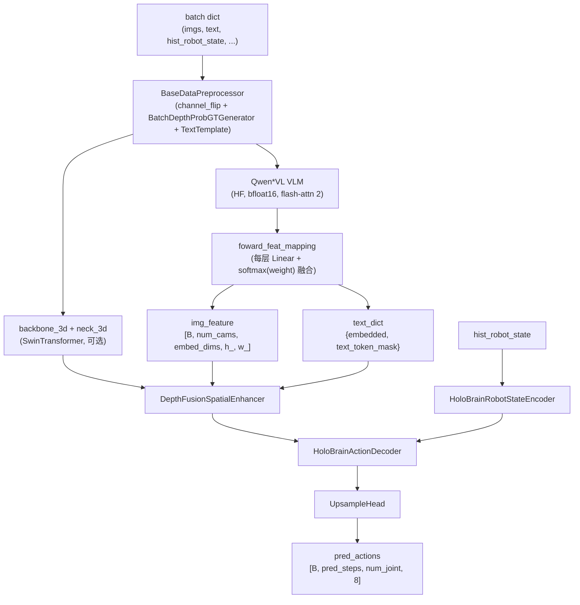

# 06 · 网络架构

> **阅读前置**：[05_dataset_pipeline](./05_dataset_pipeline.md)
>
> **本章目标**：把 HoloBrain 从"顶层 model class"到"最基础的 attention 块"逐层拆开。每一层给出 I/O shape、代码位置、和上下游连接关系。

---

## 6.1 顶层视图



## 6.2 `TextTemplate`：chat 模板拼装

来源：`robo_orchard_lab/models/holobrain/structure.py:51-116`。是 `nn.Module`，但没有可训参数——只是把 `imgs + text (+ reference_imgs) (+ subtask)` 按 Qwen chat template 拼成最终的字符串列表。

关键行：

```python
# structure.py:73
batch_size, num_cams = data["imgs"].shape[:2]
# 每个 sample 每个相机贴一段 <|vision_start|><|image_pad|><|vision_end|>
# 若有 reference_imgs，则再贴 N_ref 段
```

产物：`data["text"]` 被覆盖为已模板化的字符串列表；同时写 `data["instruction"]`、`data["image_first"]`。

Qwen3-VL 版本用 `HoloBrain_Qwen3VLTextTemplate`（`structure_qwen3_vl.py:49-77`），prompt 更简洁——无 system message，subtask 附加为 `"Current task: ..."`。

## 6.3 `HoloBrain_Qwen2_5_VL`：主模型

来源：`robo_orchard_lab/models/holobrain/structure.py:119-552`。基类 `ModelMixin`（`robo_orchard_lab/models/mixin.py`），提供 `save_model / load_model`。

### 6.3.1 子模块表

| 属性 | 类型 | 说明 |
|------|------|------|
| `self.decoder` | `HoloBrainActionDecoder` | 扩散动作解码器 |
| `self.spatial_enhancer` | 可选 `DepthFusionSpatialEnhancer` | 3D 深度融合，产 `depth_prob, loss_depth` |
| `self.data_preprocessor` | `BaseDataPreprocessor` | 在 `forward` 首行调用；见 5.11 节 |
| `self.backbone_3d`, `self.neck_3d` | 可选 `SwinTransformer` + `neck` | 处理 `inputs["depths"]` → `feature_3d` |
| `self.vlm` | `Qwen2_5_VLForConditionalGeneration` (bfloat16) | 预训练 VLM |
| `self.vlm_processor` | HF `AutoProcessor` | tokenizer + image processor |
| `self.feat_mapping` | `nn.ModuleList([Linear(H_vlm, embed_dims)] * (num_vlm_layers+1))` | **每层 VLM hidden state 一个映射** |
| `self.weight` | `nn.Parameter([L+1], bf16)` | 层融合的可学习权重（三角初始化 + temp=3） |
| `self.qwen_patch_size` | `int` | `vision_config.patch_size * spatial_merge_size`，决定 `h_ / w_` |

### 6.3.2 `__init__` 关键参数（config 里）

来自 `HoloBrain_Qwen2_5_VLConfig`（`structure.py:558-574`）：

| 字段 | 默认 | 说明 |
|------|------|------|
| `vlm_pretrain` | — | HF checkpoint dir |
| `decoder` | — | dict，被 `build` 成 `HoloBrainActionDecoder` |
| `spatial_enhancer` | 可选 | 深度融合模块 |
| `data_preprocessor` | 可选 | 数据预处理 |
| `backbone_3d`, `neck_3d` | 可选 | depth 分支 |
| `input_2d` | `"imgs"` | batch 里 2D 输入的 key |
| `input_3d` | `"depths"` | 3D 输入的 key |
| `freeze_vlm` | True | 冻结 VLM |
| `freeze_vision` | True | 冻结 vision tower |
| `use_state_dict_with_vlm` | False | 保存权重时是否包含 VLM（默认剥离）|
| `load_vlm_checkpoint` | True | 是否加载 pretrain 权重 |
| `with_cot` | False | 是否走生成式 chain-of-thought |
| `save_model_with_vlm` | False | 保存时打包 VLM |
| `num_vlm_layers` | None | 截断 VLM 只保留前 N 层 |

### 6.3.3 `forward(inputs)`

```python
# structure.py:225-232
def forward(self, inputs):
    if self.data_preprocessor is not None:
        device = next(self.parameters()).device
        inputs = self.data_preprocessor(inputs, device)
    if self.training:
        return self.loss(inputs)     # 训练：返回 loss dict
    else:
        return self.predict(inputs)  # eval：返回 list[dict] 的预测轨迹
```

`self.loss` / `self.predict` 都会转调 `self._forward(inputs)`。

### 6.3.4 `_forward(inputs)` 走读

`structure.py:415-465`，非常关键。做的事按顺序：

1. `image_list, image_is_main = self._get_image_list(inputs)`——把 `imgs [B, C, 3, H, W]` 打平成一维 image list（+ reference_imgs）供 HF processor 消化。
2. `vlm_inputs = self.vlm_processor(text=text, images=image_list, padding=True, return_tensors="pt")`——tokenizer + image processor 一步搞定 → 得到 `input_ids, image_grid_thw, pixel_values, attention_mask`。
3. `vlm_outputs = self._forward_vlm(**vlm_inputs)`（或 `_generate_vlm` 走 CoT），返回 `hidden_states: list[L+1 个 [B, seq, H_vlm]]`。
4. `feature_maps, text_dict = self._vlm_outputs_handler(vlm_outputs, vlm_inputs, inputs)`——最关键的融合与拆分（见下节）。
5. `feature_3d = self.extract_feature_3d(inputs)`——若 `with_depth=True`，用 SwinTransformer 提 depth 特征。
6. `feature_maps, depth_prob, loss_depth = self.spatial_enhancer(...)`——深度感知增强。
7. `model_outs = self.decoder(feature_maps, feature_3d, text_dict, inputs, depth_prob)`——进入扩散解码器。

### 6.3.5 `_vlm_outputs_handler`：多层特征软融合 + 图像 / 文本 token 拆分

**`foward_feat_mapping`（`structure.py:276-290`）—— 6 行代码干活的核心：**

```python
def foward_feat_mapping(self, x):
    if isinstance(x, (list, tuple)):
        x = torch.stack(x, dim=0)                     # [L+1, B, seq, H_vlm]
    weight = torch.stack(
        [layer.weight for layer in self.feat_mapping], dim=0
    )
    weight = weight[:, None]
    x = x @ weight.mT                                  # [L+1, B, seq, embed_dims]

    bias = torch.stack([layer.bias for layer in self.feat_mapping], dim=0)
    bias = bias[:, None, None]
    x = x + bias
    x = x.permute(1, 2, 3, 0)                          # [B, seq, embed_dims, L+1]
    x = x @ torch.nn.functional.softmax(self.weight, dim=0)  # [B, seq, embed_dims]
    return x
```

**图像 token 与文本 token 的分割**（`structure.py:310-346`）：

```python
img_token_mask = self.vlm.config.image_token_id == vlm_input_ids
h_, w_ = h // self.qwen_patch_size, w // self.qwen_patch_size

img_feature = vlm_outputs[img_token_mask].unflatten(0, (batch_size, -1))
feature_maps = [
    img_feature.reshape(batch_size, num_cams, h_, w_, -1)
                .permute(0, 1, 4, 2, 3)                # [B, C, embed_dims, h_, w_]
]
# 剩下的都是 text token，扣掉 pad_token
text_feature_mask = (~img_token_mask) & (vlm_input_ids != pad_token_id)
text_feature = vlm_outputs[~img_token_mask].unflatten(0, (batch_size, -1))
text_dict = {"embedded": text_feature, "text_token_mask": text_feature_mask}
```

以 `B=16, num_cams=2, patch_size=28, H=252, W=308`：
- `h_ = 252 // 28 = 9`，`w_ = 308 // 28 = 11`。
- `img_feature` reshape 到 `[16, 2, embed_dims, 9, 11]`。

### 6.3.6 CoT 分支（`with_cot=True`）

`_generate_vlm`（`structure.py:492-493`）：显式关闭 gradient checkpointing，然后 `self.vlm.generate(...)` 自回归生成最多 256 token；把生成的 `sequences` 作为 `vlm_input_ids`。

## 6.4 Qwen3.5 与 Qwen3-VL 变体

### 6.4.1 `HoloBrain_Qwen3_5_VL`

`structure_qwen3_5.py:57-172`。**继承 `HoloBrain_Qwen2_5_VL` 但重跑 `__init__`**（第 68 行 `super(HoloBrain_Qwen2_5_VL, self).__init__(cfg)` 跳过父类 init）。

关键差异：
- 用 `Qwen3_5ForConditionalGeneration / Qwen3_5Config`（受 `transformers` 版本控制的 guarded import，第 23–29 行）。
- **即使不 `freeze_vlm`，也强制冻结 `language_model.norm` 与 `language_model.layers[-1]`**（第 120–123 行）——为了对齐后续 feature mapping 的语义。
- `qwen_patch_size` 用辅助 `_get_patch_size` 计算（能处理 list/tuple 型 patch_size）。
- `_generate_vlm` 走 `self.vlm.model.language_model` 路径。

### 6.4.2 `HoloBrain_Qwen3VL`

`structure_qwen3_vl.py:80-187`。也是重跑 init。差异：
- 用 `Qwen3VLForConditionalGeneration`，**要求 `transformers >= 4.57.1`**。
- **`feat_mapping` 不 +1**：`nn.ModuleList([Linear(hidden_size, embed_dims)] * num_layers)`（第 151–161 行）——只映射保留的 transformer 层，不映射 embedding。
- `hidden_size = head_dim * num_key_value_heads`（第 147–150 行）——因为这一路把 KV-head 输出打平当"hidden state"。
- `qwen_patch_size = 32`（写死，第 172 行）。
- **`_forward_vlm` 不取普通 hidden_states，而是取 KV cache 里的 values**：

```python
# structure_qwen3_vl.py:175-184
def _forward_vlm(self, **vlm_inputs):
    vlm_outputs = self.vlm.model(**vlm_inputs)
    outputs = dict(hidden_states=[
        x.values.permute(0, 2, 1, 3).flatten(2)   # -> [B, seq, kv_heads*head_dim]
        for x in vlm_outputs.past_key_values.layers
        if x.values is not None
    ])
    return outputs
```

- `_generate_vlm` 直接 `raise NotImplementedError`——Qwen3-VL 版不支持 CoT。

## 6.5 `HoloBrainActionDecoder`（重头戏）

来源：`robo_orchard_lab/models/holobrain/action_decoder.py:179`。

### 6.5.1 扩散方案

**DDPM 训练 + DPM-Solver 推理，`prediction_type="sample"`（预测 x₀）**。证据：

- `training_noise_scheduler = DDPMScheduler(num_train_timesteps=1000, beta_schedule="squaredcos_cap_v2", prediction_type="sample", clip_sample=False)`（`config_holobrain_common.py:379-385`）。
- `test_noise_scheduler = DPMSolverMultistepScheduler(prediction_type="sample")`（`config_holobrain_common.py:386-391`）。
- `assert prediction_type == "sample"`（`action_decoder.py:223-224`）。
- 训练 loop：单次采一个 `timesteps ∈ [0, 1000)`，`scheduler.add_noise` → 网络预测 x₀ → 与 target 计算 loss（`action_decoder.py:485-487`）。
- 推理 loop：`test_noise_scheduler.set_timesteps(num_inference_timesteps=10)`，for-loop 10 步（`action_decoder.py:657-693`）。

### 6.5.2 3 个 config

| Config | 位置 | 主要字段 |
|--------|------|----------|
| `HoloBrainDecoderTransformerConfig` | `action_decoder.py:59` | `img_cross_attn / temp_joint_attn / temp_cross_attn / text_cross_attn / joint_self_attn / multi_modal_attn / norm_layer / ffn / timestep_norm_layer / operation_order` |
| `HoloBrainDecoderBaseConfig` | `action_decoder.py:109` | 扩散 / 推理 / 状态维度：`state_dims=8, embed_dims, pred_steps, chunk_size, noise_type, prediction_type, pred_scaled_joint, training_noise_scheduler, test_noise_scheduler, num_inference_timesteps, feature_level, act_cfg, with_mobile, mobile_traj_state_dims, use_joint_mask` |
| `HoloBrainTrainingConfig` | `action_decoder.py:157` | `loss, temporal_attn_drop, num_parallel_training_sample, teacher_forcing_rate, teacher_forcing_mean_steps` |

`noise_type` 四种可选：
- `"local_joint"` / `"global_joint"`：只对 `jval` 通道加噪；姿态由 FK 从加噪的 `jval` 反推。
- `"local_pose"` / `"global_pose"`：额外对 6D 姿态通道也加噪。
- 前缀 `local_*` 表示以 `hist_robot_state[:, -1]` 为均值的高斯；`global_*` 直接是标准高斯。

`prediction_type` 四种可选：`absolute_joint / relative_joint / absolute_pose / relative_pose` 的组合，例如 `"relative_joint_relative_pose"`（v9 默认）。相对量以 `hist_robot_state[:, -1]` 为参考基。

### 6.5.3 主要子模块

```python
self.head = build(head)                           # UpsampleHead(...) 见 6.7
self.mobile_head = build(mobile_head) if ...      # 仅 with_mobile=True
self.robot_encoder = build(robot_encoder)         # HoloBrainRobotStateEncoder
self.t_embed = ScalarEmbedder(condition_dims=256, freq_size=256)  # 时间步 embedding
self.input_layers = ...                           # Linear(chunk_size*state_dims -> embed_dims) + linear_act_ln
self.mobile_input_layers = ...                    # 仅 with_mobile
# 每种 op 类型都会 build 一次并塞进 ModuleDict，运行时按 operation_order 索引
```

### 6.5.4 训练 forward（`action_decoder.py:480-592`）

伪代码：

```python
timesteps = torch.randint(0, num_train_timesteps, (bs,))     # [B]
noise = self.sample_noise(shape=[B, pred_steps, num_joint, state_dims],
                          hist_robot_state, noise_type)
noisy_action = training_noise_scheduler.add_noise(
    pred_robot_state, noise, timesteps)                     # [B, T, J, 8]

# 可选 teacher forcing：以 teacher_forcing_rate 概率、Poisson(mean_steps) 长度替换 leading 段为 clean GT
# 可选 num_parallel_training_sample：把 batch 复制 P 份，让每个样本看 P 个不同噪声路径

pred, pred_mobile_traj = self.forward_layers(
    noisy_action, img_feature, text_dict, robot_feature,
    timesteps, joint_relative_pos, ...
)
return {"pred": pred, "target": pred_robot_state,
        "timesteps": timesteps, "num_parallel": ...}
```

### 6.5.5 推理（`action_decoder.py:593-717`）

```python
# 1) 若配置了 num_test_traj，把 batch 复制 K 份 -> 输出多轨迹
# 2) 拉一次纯噪声
noisy_action = sample_noise([B, pred_steps, num_joint, state_dims], hist_robot_state, noise_type)
# 3) 关键：打开 attention KV cache（imgs/text/temp_joint/multi_modal 只算一次）
self._set_attn_cache(True)
# 4) DPM-Solver 10 步
scheduler.set_timesteps(num_inference_timesteps=10)
for t in scheduler.timesteps:
    pred = self.forward_layers(noisy_action, ..., timesteps=t.expand(B), ...)
    pred = self.get_prediction(pred, hist_robot_state)   # 把 relative/scale 处理回统一坐标
    noisy_action = scheduler.step(pred, t, noisy_action).prev_sample
self._set_attn_cache(False)
# 5) 若配了 async_inference_plugin（RTC），与上一次预测的 remaining_actions 融合
```

`post_process`（`action_decoder.py:1060-1098`）在最后把通道 0 的 `jval` 用 `apply_scale_shift(inverse=True)` 还原到物理量，返回 `list[dict]` per sample。

### 6.5.6 `forward_layers` 内部（`action_decoder.py:773-1058`）

进入前的关键 reshape：

```
noisy_action:   [B, pred_steps, num_joint, state_dims]
    permute →   [B, num_joint, pred_steps, state_dims]
    reshape →   [B, num_joint, num_chunk, chunk_size*state_dims]   (num_chunk = pred_steps // chunk_size)
    input_layers → [B, num_joint, num_chunk, embed_dims]
    (可选)       + mobile row [B, 1, num_chunk, embed_dims]
    flatten →   [B, num_joint*num_chunk, embed_dims]
```

然后按 `operation_order` 依次跑：

| op 名 | 用什么模块 | shape 语义 |
|-------|------------|-----------|
| `t_norm` | `AdaRMSNorm(zero=True)` | 用 `t_embed` 生成 `(scale, shift, gate_msa, shift_mlp, scale_mlp, gate_mlp)` 六元组 |
| `joint_self_attn` | `JointGraphAttention` | 关节维 self-attn；`joint_relative_pos [B, J, J]` 作为 bias |
| `temp_cross_attn` | `RotaryAttention` | Q=action tokens, KV=拼上历史的 robot_feature；因果 mask + 历史 key 位置 |
| `temp_joint_attn` | `TemporalJointGraphAttention` | 关节×时间双向 attn（内部拼 `joint_distance` bias） |
| `text_cross_attn` | `RotaryAttention` | Q=action tokens, KV=`text_feature`（`text_key_padding_mask`） |
| `img_cross_attn` | `RotaryAttention` | Q=action tokens, KV=`img_feature` |
| `multi_modal_attn` | `MultiModalAttention` | 把上面三路合并，用软路由加权融合 |
| `norm` | `RMSNorm` | 常规 norm |
| `ffn` | `FFN` | Feed-forward，`feedforward_channels = embed_dims * 8` |
| `gate_msa`, `gate_mlp` | 元素乘 | DiT-style gate |
| `scale_shift` | 元素乘 + 元素加 | DiT-style modulation |

`temp_attn_mask` 部分（`action_decoder.py:842-855`）：一个下三角因果 mask 加上前置的 `num_hist_chunk` 个历史 key 位置；训练时以 `temporal_attn_drop=0.05` 的概率随机把这些历史 key 全部屏蔽（"CFG on state"）。

尾部（`action_decoder.py:1049-1057`）：

```
x reshape → [B, num_joint, num_chunk, embed_dims]
(若有 mobile row 分离)
x → self.head(x) → [B, num_joint, pred_steps, state_dims]
permute → [B, pred_steps, num_joint, state_dims]
```

### 6.5.7 三处"条件 dropout"（近似 CFG）

**没有对语言 token 做 dropout**，但对 proprioception 有：

| 位置 | 概率 | 什么被 drop |
|------|------|-------------|
| `MultiModalAttention.forward`（`layers.py:530-536`） | `state_drop_rate=0.2` | 三路 router 的 state 分支概率设 `-inf`，等价于该 step 完全不看历史状态 |
| `forward_layers` 时序 mask（`action_decoder.py:851-855`） | `temporal_attn_drop=0.05` | 时序 cross-attn 里的历史 key 全部被 mask |
| Teacher forcing（`action_decoder.py:540-557`） | `teacher_forcing_rate=0.02` | 把 noisy action 的前若干步替换为 clean GT——不是 dropout 但同类"引导" |

## 6.6 `HoloBrainRobotStateEncoder`

来源：`robo_orchard_lab/models/holobrain/robot_state_encoder.py`。

### 输入 / 输出

- 输入：`robot_state [B, num_step, num_link, state_dims]`（`state_dims=8`）；`joint_relative_pos [B, num_link, num_link]`；可选 `joint_mask [B, num_link]`。
- 输出：`robot_feature [B, num_link, num_chunk, embed_dims]`。

### 主要步骤

1. Permute 到 `[B, num_link, num_step, state_dims]`。
2. 若 `chunk_size > 1`：reshape 到 `[B, num_link, num_chunk, chunk_size * state_dims]`。
3. `input_fc = linear_act_ln(embed_dims, 2, 2, state_dims * chunk_size) + Linear(embed_dims, embed_dims)`。
4. 遍历 `operation_order`：`joint_self_attn`（`JointGraphAttention`，reshape 到 `[B*num_chunk, num_link, embed_dims]`）→ `temp_self_attn`（`RotaryAttention`，reshape 到 `[B*num_link, num_chunk, embed_dims]`）→ `ffn` → `norm`。
5. 返回 `[B, num_link, num_chunk, embed_dims]`，被 `HoloBrainActionDecoder.forward_layers` 当作历史状态 KV。

## 6.7 可复用 Layer 一览（`layers.py`）

| 类 (`layers.py:行`) | 一句话作用 | I/O shape |
|--------------------|----------|-----------|
| `linear_act_ln(embed, in_loops, out_loops, input_dims, act_cfg)` (43-62) | 生成一串 `[Linear, Act, ..., LayerNorm] × out_loops` 的 Sequential | 视输入 |
| `ScalarEmbedder(hidden_size, freq_size=256)` (65-92) | 正弦编码 + 2 层 MLP：`[B] → [B, hidden_size]` | 上述 |
| `RotaryEmbedding(dim, max_position_embeddings, base=10000)` (95-144) | 缓存 cos/sin 表 | — |
| `RotaryAttention(embed_dims, num_heads=8, max_position_embeddings=128)` (147-262) | Q/K 做 rotary 位置编码后走 SDPA | `q[B,N,C]` KV`[B,M,C]` → `[B,N,C]` |
| `JointGraphAttention(embed_dims, num_heads=8)` (265-344) | 关节维度 self-attention；`joint_relative_pos` 经 `ScalarEmbedder` 变成 bias 加到 Q 上 | `[B, N, C]` → `[B, N, C]` |
| `TemporalJointGraphAttention(embed_dims, num_heads=8, max_position_embeddings)` (347-461) | 关节×时间双向 attn，rotary 时间编码 + scalar `joint_distance` bias | `q[B,N,T_q,C]` KV`[B,M,T_k,C]` → `[B,N,T_q,C]` |
| `MultiModalAttention(img_cross_attn, text_cross_attn, temp_joint_attn, embed_dims, state_drop_rate=0.2, parallel_attn=False)` (464-606) | 3 路 attn 加软路由融合；训练时以 `state_drop_rate` 概率屏蔽 state 分支 | `[B, num_joint, num_step, C]` → 同 |
| `AdaRMSNorm(normalized_shape, condition_dims, zero=False)` (609-670) | RMSNorm + DiT adaLN；`zero=True` 时输出 6 元组门控 | `x[..., D], c[B, cond]` → 元组 |
| `UpsampleHead(upsample_sizes, input_dim, dims, norm, act, norm_act_idx, num_output_layers, out_dim=8)` (673-736) | 时间维 Upsample + Conv1d 反卷积，把 chunk 拉回 `pred_steps` | `[B, num_joint, num_chunk, C_in] → [B, num_joint, pred_steps, out_dim]` |

## 6.8 `HoloBrainProcessor` 与数据结构

来源：`robo_orchard_lab/models/holobrain/processor.py`。

- `MultiArmManipulationInput`（`processor.py:42-99`，dataclass）：字段 `image, depth, intrinsic, t_world2cam, t_base2cam, t_base2world, t_base2ego, history_joint_state, history_ee_pose, instruction, urdf, remaining_actions, remaining_trajs, delay_horizon`。**这是推理时的输入约定**。
- `Struct2Dict`（`processor.py:119-184`）：把 `MultiArmManipulationInput` 转成 dict。它只取 `image[cam][-1]`（最新帧）。
- `HoloBrainProcessor(ProcessorMixin)`（`processor.py:187-266`）：
  - `pre_process(data)` = `Struct2Dict` + 顺次跑 `self.transforms`。
  - `post_process(model_outputs)`：从第一个 sample 的 `pred_actions[0][..., 0]` 取 `action`（关节角度），全 `pred_actions[0]` 取 `pose`，可选 slice 到 `valid_action_step`。
  - `save / load`：序列化到 JSON，同时把引用到的 URDF 复制到 `urdf_dir` 下。
- `HoloBrainProcessorCfg`（`processor.py:269-275`）：字段 `load_image, load_depth, cam_names, valid_action_step, transforms`。

**注意**：图像 tokenization / VLM 归一化并不在 `HoloBrainProcessor` 里，而是在 `HoloBrain_Qwen*VL._forward` 内部由 `self.vlm_processor`（HF `AutoProcessor`）完成。`HoloBrainProcessor` 只负责"从 Manipulation 数据类到模型 batch dict"这段。

## 6.9 `HoloBrainInferencePipeline`

来源：`robo_orchard_lab/models/holobrain/pipeline.py:46-125`。继承 `robo_orchard_lab.inference.basic.InferencePipeline`（不是 HF `pipeline`）。

- `__init__(cfg, model)`：拿到 `HoloBrainProcessor`（`cfg.processor`）与一个 `TorchModelMixin` 实例（比如 `HoloBrain_Qwen2_5_VL`）。
- `__call__(data: MultiArmManipulationInput) → MultiArmManipulationOutput`（`pipeline.py:57-60`）：委托给基类，内部依次跑 `processor.pre_process → model.forward → processor.post_process`。
- `save_pipeline(directory, ..., save_model=True, urdf_dir="./urdf")`：写 `{inference_prefix}.config.json`（`model_cfg=None` 避免重复），拷 URDF，调 `self.model.save_model(...)`。

## 6.10 `utils.py` 里的辅助

来源：`robo_orchard_lab/models/holobrain/utils.py`。

| 函数 | 位置 | 作用 |
|------|------|------|
| `apply_scale_shift(robot_state, joint_scale_shift, inverse=False, scale_only=False)` | 20-82 | 归一化/反归一化通道 0；shape 广播 `num_parallel` |
| `forward_kinematics(joint_state, inputs)` | 85-139 | 遍历 `kinematics` 列表调 `joint_state_to_robot_state`，输出 `[B, T, J, 8]` |
| `recompute(robot_state, inputs)` | 142-179 | `apply_scale_shift(inverse) → FK → 拼回原 jval 通道` |
| `apply_joint_mask(robot_state, joint_mask, constant_value=-1)` | 182-212 | 把被 mask 的关节位置写成常数 -1（只动通道 0） |

## 6.11 公开 API 表

`robo_orchard_lab/models/holobrain/__init__.py` 导出：

- **顶层模型**：`HoloBrain_Qwen2_5_VL`, `HoloBrain_Qwen2_5_VLConfig`, `TextTemplate`, `HoloBrain_Qwen3_5_VL`, `HoloBrain_Qwen3_5_VLConfig`, `HoloBrain_Qwen3VL`, `HoloBrain_Qwen3VLConfig`, `HoloBrain_Qwen3VLTextTemplate`。
- **动作解码器**：`HoloBrainActionDecoder`, `HoloBrainDecoderBaseConfig`, `HoloBrainDecoderTransformerConfig`, `HoloBrainTrainingConfig`。
- **状态 encoder**：`HoloBrainEncoderBaseConfig`, `HoloBrainEncoderTransformerConfig`, `HoloBrainRobotStateEncoder`。
- **layers**：`AdaRMSNorm`, `JointGraphAttention`, `MultiModalAttention`, `RotaryAttention`, `RotaryEmbedding`, `ScalarEmbedder`, `TemporalJointGraphAttention`, `UpsampleHead`。
- **loss**：`HoloBrainActionLoss`。
- **processor / pipeline**：`HoloBrainProcessor`, `HoloBrainProcessorCfg`, `HoloBrainInferencePipeline`, `HoloBrainInferencePipelineCfg`。

`MultiArmManipulationInput / Output`、`Struct2Dict`、`linear_act_ln`、`apply_scale_shift / recompute / apply_joint_mask / forward_kinematics` 未直接 re-export，但都可以通过完整路径 import。

---

**下一篇 →** [07_forward_pass.md](./07_forward_pass.md)
