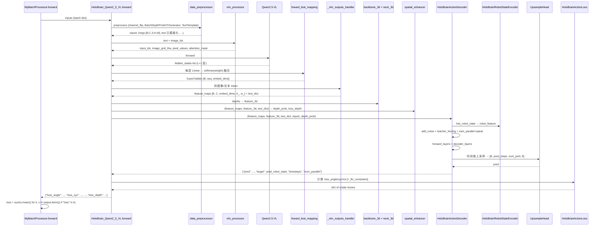

# 07 · 端到端 Forward 走读

> **阅读前置**：[05_dataset_pipeline](./05_dataset_pipeline.md)、[06_model_architecture](./06_model_architecture.md)
>
> **本章目标**：手把手一次训练 forward 从 batch 进入到 loss 出来的完整调用链；顺带过一遍推理时的差异。用一组具体 shape（`B=16, num_cams=2, num_joint=8, pred_steps=64, chunk_size=4, num_chunk=16, embed_dims=384`）把每一步都算清楚。

---

## 7.1 训练 forward 全景（Mermaid）



## 7.2 第 0 步：数据进入模型之前

在 `MyBatchProcessor.forward`（`train.py:53-56`）里：

```python
def forward(self, model, batch):
    output = model(batch)                                          # -> loss dict（training） 或 list[dict]（eval）
    loss = sum([y.mean() for x, y in output.items() if "loss" in x])
    return output, loss
```

**"所有 key 含 `loss` 的值一律求平均后相加"**——这解释了为什么 `HoloBrainActionLoss` 返回的 dict 里 key 都以 `loss_` 打头。想加/减 loss 项，直接在返回 dict 里加/删对应 key 即可，不用改 `MyBatchProcessor`。

`batch` 的字段结构见 [05 章第 5.7 节](./05_dataset_pipeline.md#57-最终-batch-dict-完整字段)。

## 7.3 第 1 步：`forward` 分支

`structure.py:225-232`：

```python
def forward(self, inputs):
    if self.data_preprocessor is not None:
        device = next(self.parameters()).device
        inputs = self.data_preprocessor(inputs, device)
    if self.training:
        return self.loss(inputs)     # 训练分支
    else:
        return self.predict(inputs)  # 推理分支（no_grad）
```

`self.training` 由 `nn.Module.train() / eval()` 控制；训练时 accelerator 已把它设为 `True`。

## 7.4 第 2 步：`data_preprocessor`

来源：`robo_orchard_lab/models/layers/data_preprocessors.py:BaseDataPreprocessor` + `config_holobrain_common.py:224-245`。

- **`channel_flip=True`**：`imgs [B, C, H, W, 3]` 内部 `[..., [2,1,0]]`（BGR→RGB）。**注意**：在数据侧 `ImageChannelFlip` 已经做过一次；这里又做一次是为了统一确保进入 VLM 前一定是 RGB。
- **`unsqueeze_depth_channel=True`**：`depths [B, C, H, W]` → `[B, C, 1, H, W]`（加通道维）。
- **`batch_transforms`**：顺次调用：
  - `BatchDepthProbGTGenerator(min_depth, max_depth, num_depth, origin_stride=2, valid_threshold=0.5, stride=(patch_size,))` —— 生成每个 patch 的深度分类 GT（用于 `loss_depth`）。
  - `TextTemplate(with_subtask=training_with_subtask, image_first=True)` —— 已在 [06 章 6.2](./06_model_architecture.md#62-texttemplate) 讲过；这里把 `data["text"]` 重写成完整 chat prompt。

之后 `imgs` 会被 permute 到 `[B, C, 3, H, W]`（channel dim 移到 -3）供 `_get_image_list` 用。

## 7.5 第 3 步：`_get_image_list`（`structure.py:382-413`）

把 `[B, num_cams, 3, H, W]` 拆成一个长度 `B*num_cams`（或更多，如果有 reference_imgs）的图像列表：

```python
image_list = self._split_images(inputs["imgs"].flatten(0, 1))  # -> num_cams * B 张 (3, H, W) tensor
```

如果 config 里带 `reference_imgs`，会按 `image_first` 顺序穿插 main 图与 reference 图，并维护 `image_is_main` bool 列表——后面 `_build_main_img_mask` 用它区分哪些是主图哪些是参考图。

**shape 举例**（`B=16, num_cams=2`）：`image_list` 长度 32，每个元素 `torch.Tensor [3, 252, 308]`。

## 7.6 第 4 步：HF `vlm_processor`

`structure.py:421-427`：

```python
vlm_inputs = self.vlm_processor(
    text=text,                # list[str], 长度 B
    images=image_list,        # list[Tensor], 长度 B*num_cams
    padding=True,
    return_tensors="pt",
)
vlm_inputs = vlm_inputs.to(device)
```

`vlm_inputs` 包含：
- `input_ids [B, L_text]`（含 `<|image_pad|>` 占位）；
- `attention_mask [B, L_text]`；
- `pixel_values [total_patches, patch_dim]`；
- `image_grid_thw [B*num_cams, 3]`——每张图的 `(t, h, w)` patch 数。

## 7.7 第 5 步：VLM forward

两个分支：

- `not self.with_cot`：`vlm_outputs = self._forward_vlm(**vlm_inputs)`。对于 Qwen2.5-VL（`structure.py:467-490`），做的事就是 `self.vlm(**vlm_inputs, output_hidden_states=True)` 拿到所有层 `hidden_states`。Qwen3-VL 版走 KV cache（见 [06 章 6.4.2](./06_model_architecture.md#642-holobrain_qwen3vl)）。
- `with_cot=True`：`_generate_vlm` 关闭 gradient checkpointing 后走 `self.vlm.generate(max_new_tokens=256, ...)`。

**输出**：`vlm_outputs["hidden_states"]` 是长度 `L+1` 的 list（第 0 项是 embedding 层输出，第 1..L 项是各 transformer 层）。每项 shape `[B, L_text, H_vlm]`。

以 `num_vlm_layers=4`：list 长度 5；`H_vlm = 2048`（Qwen2.5-VL-3B）。

## 7.8 第 6 步：多层特征软融合

`_vlm_outputs_handler → foward_feat_mapping`（`structure.py:276-290`）。

```python
# 输入 hidden_states: list of [B, seq, H_vlm]
# 输出 fused: [B, seq, embed_dims]
```

计算：
- `feat_mapping[l](x[l])` = `Linear(H_vlm → embed_dims)`：`[B, seq, embed_dims]`；
- stack 得 `[L+1, B, seq, embed_dims]`；
- `permute → [B, seq, embed_dims, L+1]`；
- `@ softmax(self.weight)` （权重 shape `[L+1]`）→ `[B, seq, embed_dims]`。

用 `torch.utils.checkpoint.checkpoint` 包起来省显存（`structure.py:304-306`）。

**注意** `hidden_states` 类型是 bf16；出来后立刻 `.to(torch.float32)`（`structure.py:308`），后面所有下游都是 fp32。

## 7.9 第 7 步：拆分图像 token 与文本 token

`structure.py:310-346`：

```python
img_token_mask = (vlm_input_ids == self.vlm.config.image_token_id)   # bool [B, seq]
h_ = h // self.qwen_patch_size
w_ = w // self.qwen_patch_size

img_feature = fused[img_token_mask].unflatten(0, (batch_size, -1))
# reshape 为 [B, num_cams, h_, w_, embed_dims] 再 permute
feature_maps = [
    img_feature.reshape(batch_size, num_cams, h_, w_, -1)
                .permute(0, 1, 4, 2, 3)                              # [B, C, embed_dims, h_, w_]
]

text_feature_mask = (~img_token_mask) & (vlm_input_ids != pad_token_id)
text_feature = fused[~img_token_mask].unflatten(0, (batch_size, -1))
text_dict = {"embedded": text_feature, "text_token_mask": text_feature_mask}
```

**具体 shape**（`B=16, num_cams=2, patch_size=28, H=252, W=308, embed_dims=384`）：
- `h_ = 252 // 28 = 9`，`w_ = 308 // 28 = 11`；
- 每张图产生 `9*11 = 99` 个 image token；
- `feature_maps[0]: [16, 2, 384, 9, 11]`；
- `text_feature: [16, N_text, 384]`，`N_text` 约等于 chat prompt 里的非图像 non-pad token 数。

## 7.10 第 8 步：深度分支（可选）

`extract_feature_3d`（`structure.py:249-268`）：

```python
input_3d = inputs["depths"].to(dtype=torch.bfloat16)       # [B, C, 1, H, W]
input_3d = input_3d.flatten(end_dim=1)                     # [B*C, 1, H, W]
feature_3d = self.backbone_3d(input_3d)                    # Swin, [B*C, C_out, h_d, w_d]
feature_3d = self.neck_3d(feature_3d)                      # 可选
feature_3d = [x.unflatten(0, (B, C)) for x in feature_3d]  # [B, C, ...]
```

以 `patch_size=28, patch_size//4=7`，Swin patch_size=7 + `strides=[7, 2, 2]`：`h_d = H // (7*2*2) = 9`，`w_d = 11`（与 image token 网格对齐）。

## 7.11 第 9 步：`spatial_enhancer`

`config_holobrain_common.py:268-282`：`DepthFusionSpatialEnhancer`（来自 `robo_orchard_lab.models.bip3d.spatial_enhancer`）。

- 输入：`feature_maps`（VLM 图像特征）、`feature_3d`（Swin 深度特征）、`text_dict`、`inputs`（含 `projection_mat` 等）。
- 输出：`(enhanced_feature_maps, depth_prob, loss_depth)`。`depth_prob` 是每个 image patch 的深度分布 `[B, C, num_depth, h_, w_]`；`loss_depth` 是训练时的辅助 loss。
- 具体机理：把 depth 特征投到与 image 特征相同的 3D 网格，做 cross-attention 增强；再用 `BatchDepthProbGTGenerator` 生成的 GT 与 `depth_prob` 算交叉熵。

`loss_depth`（若非 None）会被外层加到 `loss` dict 里（`structure.py:237-239`）。

## 7.12 第 10 步：进入 `HoloBrainActionDecoder`

```python
model_outs = self.decoder(
    feature_maps=feature_maps,       # [B, C, embed_dims, h_, w_]
    feature_3d=feature_3d,           # 可选
    text_dict=text_dict,             # {embedded, text_token_mask}
    inputs=inputs,                   # 原 batch，仍需 hist_robot_state / joint_relative_pos / joint_scale_shift ...
    depth_prob=depth_prob,           # 可选
)
```

`HoloBrainActionDecoder.forward` 里做两件事：
- **训练分支**（`action_decoder.py:480-592`）：加噪 + `forward_layers` + 返回 `{"pred", "target", ...}`。
- **推理分支**（`action_decoder.py:593-717`）：10 步 DPM-Solver，返回 `{"pred_actions", "pred_mobile_trajs"}`。

### 7.12.1 训练分支：加噪与 `num_parallel`

```python
# action_decoder.py:485-522
bs = pred_robot_state.shape[0]                              # B=16
timesteps = torch.randint(0, num_train_timesteps, (bs,))   # [B]
noise = self.sample_noise(
    [bs, pred_steps, num_joint, state_dims],
    hist_robot_state,
    noise_type=self.base_cfg.noise_type,                    # "local_joint" 时只对 jval 加噪
)
noisy_action = training_noise_scheduler.add_noise(
    pred_robot_state, noise, timesteps)                     # [B, 64, 8, 8]

if num_parallel_training_sample > 1:                        # 默认 4
    # 把 batch 复制 P 份 -> [B*P, ...]，每份用不同 noise
    ...
```

`num_parallel=4` 后所有张量的第 0 维变成 `B*P = 64`。这在 loss 计算时会 `unflatten(0, (P, B))` 再做 winner-takes-all 选择。

### 7.12.2 训练分支：teacher forcing

`action_decoder.py:540-557`：

```python
if self.training and teacher_forcing_rate > 0:
    mask = torch.rand(bs) < teacher_forcing_rate            # [B*P]
    if mask.any():
        # Poisson 采样一个 span 长度
        spans = torch.poisson(torch.full([mask.sum()], teacher_forcing_mean_steps))
        # 把 leading 段替换为干净 GT
        ...
```

以 `teacher_forcing_rate=0.02` 且 `teacher_forcing_mean_steps=pred_steps//4=16`：约 2% 的样本每次会把开头 ~16 步替换为 clean GT，缓解自回归漂移。

### 7.12.3 训练分支：`forward_layers`

调用：

```python
pred, pred_mobile_traj = self.forward_layers(
    noisy_action, feature_maps[0], text_dict,
    robot_feature, timesteps, joint_relative_pos, ...
)
```

内部展开顺序（[06 章 6.5.6](./06_model_architecture.md#656-forward_layers-内部action_decoderpy773-1058)）已详列。重点看 shape 变化：

```
noisy_action           [B*P, 64, 8, 8]
  permute →            [B*P, 8, 64, 8]
  chunk reshape →      [B*P, 8, 16, 32]     (32 = chunk_size * state_dims = 4 * 8)
  input_layers →       [B*P, 8, 16, 384]    (embed_dims)
  flatten joint-time → [B*P, 128, 384]      (128 = 8 * 16)

t_embed(timesteps)  → [B*P, 256]
robot_feature       ← HoloBrainRobotStateEncoder(hist_robot_state)
                      形状 [B*P, num_link=8, num_hist_chunk, 384]

for op in operation_order:
    # 例如 v9 的 multi_modal_attn 版本
    if op == "t_norm":     x, gates = AdaRMSNorm(x, t_embed)
    if op == "multi_modal_attn":
        # Q = x (action tokens)
        # KV_img = img_feature展平 = [B*P, num_cams * h_ * w_, 384]  = [B*P, 198, 384]
        # KV_text = text_feature = [B*P, N_text, 384]
        # KV_state = robot_feature展平 = [B*P, 8 * num_hist_chunk, 384]
        # 三路 attn + router 融合
    if op == "gate_msa":   x = residual + gate_msa * attn_out
    if op == "norm":       x = RMSNorm(x)
    if op == "scale_shift":x = (1 + scale_mlp) * x + shift_mlp
    if op == "ffn":        x = FFN(x)
    if op == "gate_mlp":   x = residual + gate_mlp * ffn_out
```

十次这样的 block（`decoder_layers=10`）后：

```
x → unflatten → [B*P, 8, 16, 384]
head(x) → [B*P, 8, 64, 8]                    # UpsampleHead 把 16 chunk 上采样到 64 步
permute → [B*P, 64, 8, 8]                    # -> pred
```

### 7.12.4 训练分支：返回 dict

```python
return {
    "pred": pred,                           # [B*P, 64, 8, 8]
    "target": pred_robot_state.repeat(P, 1, 1, 1),  # 若 P>1，target 同样重复
    "timesteps": timesteps,                 # [B*P]
    "num_parallel": num_parallel,           # 4
    "pred_mobile_traj": pred_mobile_traj,   # 可选
    "target_mobile_traj": ...,              # 可选
}
```

## 7.13 第 11 步：Loss 汇总

回到 `HoloBrain_Qwen2_5_VL.loss`（`structure.py:234-239`）：

```python
def loss(self, inputs):
    model_outs, _, text_dict, loss_depth = self._forward(inputs)
    loss = self.decoder.loss(model_outs, inputs, text_dict=text_dict)
    if loss_depth is not None:
        loss["loss_depth"] = loss_depth
    return loss
```

`self.decoder.loss` 实际调用 `HoloBrainActionLoss.forward(model_outs, inputs)`（`loss.py:57-111`）。它按下面顺序算：

1. `robot_state_loss(pred, target, weight, ...)` → `{loss_angle, loss_xyz, loss_rot}`。
2. 若 `fk_loss_weight` 非空：`fk_pred = recompute(pred, inputs)` → `robot_state_loss(fk_pred, target, weight, suffix="_fk")` → `{loss_angle_fk, loss_xyz_fk, loss_rot_fk}`。
3. 若 `with_consistent_loss=True`：`robot_state_loss(pred, fk_pred.detach(), weight, suffix="_consistent")` → 三个 `_consistent` loss。
4. 若 `pred_mobile_traj` 非 None：`mobile_trajectory_loss` → `{loss_mobile}`。
5. 外层再加上 `loss_depth`。

`loss.py` 逻辑详解见 [08 章](./08_loss_and_training.md#82-loss-项)。

`MyBatchProcessor.forward` 拿到这个 dict 后 `sum(v.mean() for k, v in ... if "loss" in k)` 得到一个标量给 `accelerator.backward`。

## 7.14 推理分支（`predict`）

```python
@torch.no_grad()
def predict(self, inputs):
    model_outs, _, text_dict = self._forward(inputs)
    results = self.decoder.post_process(model_outs, inputs, text_dict=text_dict)
    return results
```

`self.decoder(inputs)` 走 `action_decoder.py:593-717` 的 `else` 分支：

1. **多轨迹复制**：若 `num_test_traj > 1`，先把 batch 复制 K 份得到 `[B*K, ...]`。
2. **纯噪声起点**：`noisy_action = sample_noise(...)`。
3. **打开 KV cache**：`self._set_attn_cache(True)`——`img_cross_attn / text_cross_attn / temp_joint_attn / multi_modal_attn` 内部会记住 K/V 与 rotary cache；接下来 10 次 `forward_layers` 只重算 Q。
4. **10 步 DPM-Solver**：

```python
scheduler.set_timesteps(num_inference_timesteps=10)
for t in scheduler.timesteps:
    pred = self.forward_layers(noisy_action, ..., timesteps=t.expand(B*K), ...)
    pred = self.get_prediction(pred, hist_robot_state)     # 处理 relative / scale
    noisy_action = scheduler.step(pred, t, noisy_action).prev_sample
```

5. **关掉 KV cache 释放显存**：`self._set_attn_cache(False)`。
6. **RTC async 融合**（可选）：若配了 `async_inference_plugin`，与前一次预测的 `remaining_actions` 融合（`realworld_eval.py` 里挂 `RTCInferencePlugin`）。
7. `post_process`（`action_decoder.py:1060-1098`）：`apply_scale_shift(inverse=True)` 反归一化通道 0；返回 `list[dict]`（每个 sample 一个 dict，含 `pred_actions [num_traj, pred_steps, num_joint, 8]`）。

## 7.15 一图总结 shape 变化

以 `B=16, num_cams=2, H=252, W=308, patch_size=28, num_joint=8, hist_steps=1, pred_steps=64, chunk_size=4, num_chunk=16, embed_dims=384, num_parallel_training_sample=4`：

```
imgs                                 [16, 2, 3, 252, 308]
  ↓ vlm_processor
vlm_outputs.hidden_states  list of  [16, seq, 2048]     × (num_vlm_layers+1)
  ↓ foward_feat_mapping (Linear + softmax weight)
fused hidden                         [16, seq, 384]
  ↓ split by image_token_id
img_feature   permute →              [16, 2, 384, 9, 11]
text_feature                         [16, N_text, 384]
  ↓ spatial_enhancer + backbone_3d/neck_3d (可选)
feature_maps[0]                      [16, 2, 384, 9, 11]  (增强)

hist_robot_state                     [16, 1, 8, 8]
  ↓ HoloBrainRobotStateEncoder
robot_feature                        [16, 8, num_hist_chunk, 384]  ≈ [16, 8, 1, 384]

pred_robot_state                     [16, 64, 8, 8]
  ↓ add_noise + repeat(P=4)
noisy_action                         [64, 64, 8, 8]  (P*B)
  ↓ 展平 chunk / input_layers
action tokens                        [64, 128, 384]  (8*16 tokens)
  ↓ 10 × block(attn + FFN)
                                     [64, 128, 384]
  ↓ unflatten + UpsampleHead
pred                                 [64, 64, 8, 8]  (P*B)

loss_angle/xyz/rot [+_fk] +          scalar × 6 or 7
loss_depth                            scalar
mean & sum →                          单一 loss 标量
```

## 7.16 排错线索速查

| 症状 | 最可能的位置 | 检查什么 |
|------|-------------|----------|
| `RuntimeError: shape [...] cannot be multiplied` in decoder | `forward_layers` 里 attention | 关节数 / cam 数不一致；`DistributedBatchFlagSampler` 是否失效 |
| `KeyError: 'hist_robot_state'` | `HoloBrainRobotStateEncoder.forward` | transforms 链里没跑 `SimpleStateSampling` 或 `MultiArmKinematics` |
| `loss = nan` 全 nan | Loss 或 add_noise | `state_loss_weights` 是否含 NaN；`joint_scale_shift` 是否 0 |
| `loss_depth` 巨大 | `spatial_enhancer` | `min_depth / max_depth` 与实际数据不匹配 |
| `image_token_id == vlm_input_ids` 全 False | `TextTemplate` | prompt 里没插入 `<|image_pad|>`；查 `training_with_subtask / image_first / reference_imgs` 是否触发到未测过的分支 |

---

**下一篇 →** [08_loss_and_training.md](./08_loss_and_training.md)
