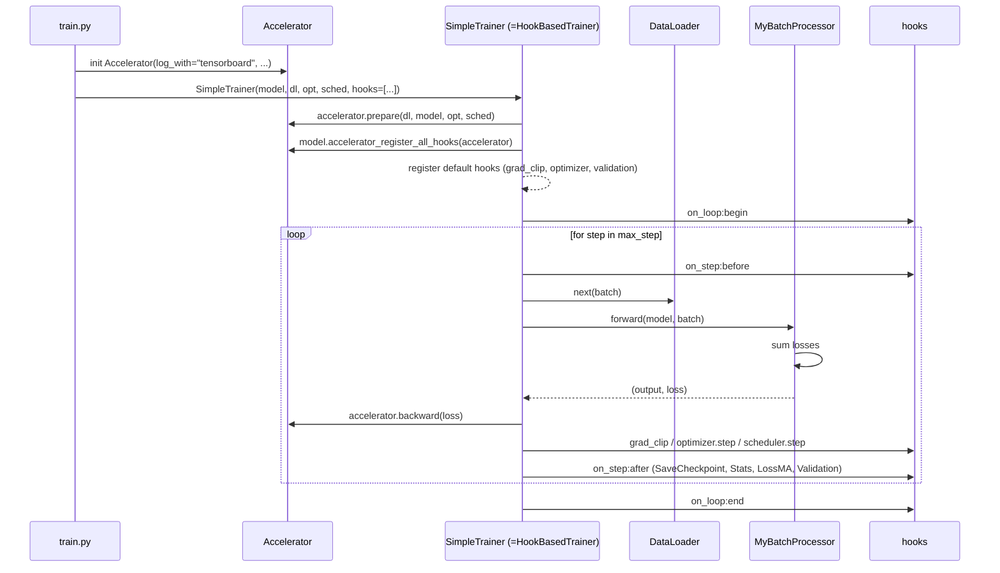

# 08 · Loss 与训练循环

> **阅读前置**：[06_model_architecture](./06_model_architecture.md)、[07_forward_pass](./07_forward_pass.md)
>
> **本章目标**：说清所有 loss 项的物理含义、损失聚合规则、训练器 hook 触发时序、优化器与学习率策略、Accelerate 多卡与 checkpoint 机制。

---

## 8.1 训练循环骨架



## 8.2 Loss 项

来源：`robo_orchard_lab/models/holobrain/loss.py`。类 `HoloBrainActionLoss(nn.Module)`（第 29 行）。

### 8.2.1 构造参数（v9 默认值来自 `config_holobrain_common.py:400-406`）

| 参数 | 默认 | 作用 |
|------|------|------|
| `default_state_loss_weight` | `None` | 当 batch 中没有 `state_loss_weights` 时的备用权重 |
| `default_fk_loss_weight` | `None` | 类似，FK 分支 |
| `default_mobile_loss_weight` | `1.0` | mobile 分支 |
| `loss_mode` | `"smooth_l1"`（v9） / 默认 `"l2"` | 误差范数：`l1 / l2 / smooth_l1` |
| `smooth_l1_beta` | `0.04` | smooth_l1 的转折点 |
| `with_wasserstein_distance` | `True` | 用 3×3 旋转矩阵欧氏距离，而非四元数直接差 |
| `with_consistent_loss` | `False` | 是否再加 `_consistent` 分支 |
| `timestep_loss_weight` | `1000` | 时间步降权系数（除以 `t+1`） |
| `parallel_loss_weight` | `0.1` | winner-takes-all 里"非最优"轨迹的权重 |

### 8.2.2 每一项 loss 详解

**1. `loss_angle` / `loss_xyz` / `loss_rot`**（`loss.py:113-142`）：

```python
rot_size = pred.shape[-1] - 4                                # 4 = 1(angle) + 3(xyz)
pred_angle, pred_xyz, pred_rot = pred.split([1, 3, rot_size], dim=-1)
tgt_angle, tgt_xyz, tgt_rot   = target.split([1, 3, rot_size], dim=-1)

if with_wasserstein_distance:
    pred_rot = quaternion_to_matrix(pred_rot).flatten(-2)   # [..., 9]
    tgt_rot  = quaternion_to_matrix(tgt_rot).flatten(-2)

loss_angle = _loss_func(pred_angle, tgt_angle, w_angle, **kwargs)
loss_xyz   = _loss_func(pred_xyz,   tgt_xyz,   w_xyz,   **kwargs)
loss_rot   = _loss_func(pred_rot,   tgt_rot,   w_rot,   **kwargs)
```

- `pred / target` shape `[B*P, T, J, 8]`（`P` 是 `num_parallel_training_sample`）。
- **`loss_angle`**：通道 0 关节角度回归；单位是归一化后的量（因为 `pred_scaled_joint=False`，通道 0 内部已经归一化 → 计算 loss 时也在归一化空间比较）。
- **`loss_xyz`**：通道 1–3 位置回归，单位米。
- **`loss_rot`**：通道 4–7 姿态；`with_wasserstein_distance=True` 时把四元数展成 3×3 旋转矩阵再算欧氏距离——避免四元数双覆盖（`q` 与 `-q` 表示同一姿态）导致的鞍点。旋转权重也做了 shape 对齐（`loss.py:127-133`）。

**2. `loss_angle_fk` / `loss_xyz_fk` / `loss_rot_fk`**（`loss.py:74-87`）：

```python
if fk_loss_weight is not None:
    fk_pred = recompute(pred, inputs)     # 把 pred 的通道 0 反归一化后跑 FK
    output.update(robot_state_loss(fk_pred, target, fk_loss_weight, suffix="_fk"))
```

`recompute`（`utils.py:142-179`）：`apply_scale_shift(inverse=True)` → `forward_kinematics` → 拼回。**用途**：让网络预测的关节角度经过 FK 后，仍然与目标 EE pose 匹配。物理意义等同"loss on the reachable trajectory"。

**3. `loss_angle_consistent` / `loss_xyz_consistent` / `loss_rot_consistent`**（`loss.py:88-99`）：

```python
if with_consistent_loss:
    output.update(robot_state_loss(pred, fk_pred.detach(), fk_loss_weight, suffix="_consistent"))
```

**pred 与 `fk_pred.detach()` 做 loss**——迫使网络的原始预测本身就已经"运动学一致"，无需再靠 FK 修正。

**4. `loss_mobile`**（`loss.py:144-149`）：`_loss_func(pred_mobile_traj, target_mobile_traj, weight)`，只在 `with_mobile=True` 时启用。若 `target_mobile_traj is None`，用 `_fake_loss(pred) = pred.sum() * 0`（形式 loss，防止梯度图断裂）。

**5. `loss_depth`**：来自 `spatial_enhancer` 返回的深度分类交叉熵；在 `HoloBrain_Qwen2_5_VL.loss` 里被拼到 dict（`structure.py:237-239`）。

### 8.2.3 `_loss_func` 的三重"trick"

`loss.py:151-211` 是所有 loss 的核心 helper。三个可选的加权：

**Trick 1：`num_parallel` 展开**（`loss.py:172-173`）

```python
if num_parallel is not None:
    error = error.unflatten(0, (-1, num_parallel)).transpose(0, 1)
    # 从 [B*P, ...] 变为 [P, B, ...]
```

**Trick 2：`timestep_loss_weight` 时间步降权**（`loss.py:182-188`）

```python
timestep_weight = self.timestep_loss_weight / (timestep + 1)   # t=0 时权重 1000，t=999 时约 1
error = error * timestep_weight
```

含义：扩散早期（大 t，靠近纯噪声）loss 权重小，晚期（小 t，靠近 clean sample）权重大。这个"降权"策略让模型专注于 fine-tune 高信噪比区。

**Trick 3：`parallel_loss_weight` winner-takes-all**（`loss.py:190-204`）

```python
if parallel_loss_weight is not None:
    min_idx = error.flatten(2).sum(-1).argmin(dim=0)          # 每个 sample 选出 P 份中最优
    parallel_weight = error.new_full([num_parallel, bs], parallel_loss_weight)
    parallel_weight[min_idx, bs_idx] = 1                      # 最优给权重 1，其它 0.1
    error = (error * parallel_weight).sum(dim=0)
else:
    error = error.mean(dim=0)                                 # 简单平均
```

含义：每个样本预测 `P=4` 条轨迹，只强奖励最接近 GT 的那一条（权重 1），其它三条给较小权重（0.1）。这鼓励**模式寻找**——每次都尝试"押中"一种可能的动作，而不是把 4 条都学成 mean-mode 而糊在一起。是 HoloBrain 处理多模态动作的关键设计。

**Trick 4：`pred_mask` 过滤**（`loss.py:206-207`）

```python
if pred_mask is not None:
    error = error[pred_mask]
    if error.shape[0] == 0: return _fake_loss(pred)
```

`pred_mask` 来自 `SimpleStateSampling`，标记"实际预测的步"（尾部被 padding 的部分为 False）。

最后 `loss = error.sum(dim=-1).mean()`——最后一个特征维求和，其余维求平均。

### 8.2.4 Loss dict 完整清单（v9 默认）

| Key | 何时出现 | 单位 |
|-----|----------|------|
| `loss_angle` | 总有 | normalized rad |
| `loss_xyz` | 总有 | m² (smooth_l1) |
| `loss_rot` | 总有 | rot mat 元素平方差 |
| `loss_angle_fk` | 有 `fk_loss_weight` | 同上（FK 版） |
| `loss_xyz_fk` | 同上 | |
| `loss_rot_fk` | 同上 | |
| `loss_angle_consistent` | `with_consistent_loss=True` | |
| `loss_xyz_consistent` | 同上 | |
| `loss_rot_consistent` | 同上 | |
| `loss_mobile` | `with_mobile=True` | |
| `loss_depth` | `with_depth_loss=True` | 深度分类 CE |

## 8.3 优化器与学习率

来源：`config_holobrain_common.py:459-509`。

### 8.3.1 参数分组

```python
vlm_params = []
bit16_params = []
other_params = []
for name, p in model.named_parameters():
    if "vlm." in name:
        if p.requires_grad: vlm_params.append(p)
    elif p.dtype in (torch.float16, torch.bfloat16):
        bit16_params.append(p)
    else:
        other_params.append(p)

optim_params = [
    {"params": bit16_params},
    {"params": other_params},
]
if vlm_params:
    optim_params.append({"params": vlm_params, "lr": base_lr * 0.1})   # ★ VLM 组 lr 是主 lr 的 10%
```

三个组：
- fp16/bf16 组（`feat_mapping` 里的 Linear 之类）；
- fp32 组（decoder 主体）；
- VLM 组（学习率 `1e-4 × 0.1 = 1e-5`）——保护预训练权重不被大梯度冲坏。

### 8.3.2 学习率调度

```python
optimizer = optim.AdamW(optim_params, lr=1e-4, weight_decay=0.0005)

lr_scheduler = optim.lr_scheduler.ChainedScheduler([
    optim.lr_scheduler.LinearLR(optimizer, start_factor=0.001, total_iters=warmup_step),
] + (
    [] if config.get("pretrain", False)
    else [optim.lr_scheduler.MultiStepLR(optimizer, milestones=[int(max_step * 0.9)], gamma=0.1)]
))
```

- 前 `warmup_step=500` 步从 `0.001×base_lr` 线性升到 `base_lr`；
- 最后 10% 步 `× 0.1`（`MultiStepLR`，`milestones=[int(max_step * 0.9)]`）；
- 若 `pretrain=True`（长时间预训练），不做后段衰减。

在 `train.py:197` 里 `lr_scheduler_step_at="step"`（唯一被 `HookBasedTrainer` 支持的值），意味着每个 optimizer.step 后调一次 `lr_scheduler.step()`。

## 8.4 Accelerate 集成

来源：`train.py:228-242`。

```python
accelerator = Accelerator(
    log_with="tensorboard",
    step_scheduler_with_optimizer=False,           # 不让 accelerate 自动帮我们 step scheduler
    project_config=ProjectConfiguration(
        project_dir=args.workspace,
        logging_dir=args.logging_dir,
        automatic_checkpoint_naming=True,          # save_state 自动命名 checkpoint_0, _1, ...
        total_limit=3,                             # 只保留最近 3 份
    ),
    dataloader_config=DataLoaderConfiguration(
        use_seedable_sampler=True,                 # 可复现
        non_blocking=True,                         # H2D 异步
    ),
)
accelerator.init_trackers("tensorboard")
```

- **单/多卡切换**由 `accelerate launch` 的 CLI（或 `~/.cache/huggingface/accelerate/default_config.yaml`）决定；`train.py` 不显式指定 `mixed_precision / gradient_accumulation_steps`。
- **`accelerator.prepare(dl, model, optimizer, lr_scheduler)`** 在 `HookBasedTrainer.__init__` 里被一次性调用（`robo_orchard_lab/pipeline/hook_based_trainer.py:295-302`）——这一步把 dataloader / model / optimizer / lr_scheduler 都包装成分布式版本。
- **DataLoader 特例**：由于 `train.py` 用的是 `batch_sampler=DistributedBatchFlagSampler(...)`（不是普通 `sampler=`），accelerate 会把它当成"已经 sharded"的 sampler，跳过自动加 `DistributedSampler`。rank 分片由 `DistributedBatchFlagSampler` 自己按 `torch.distributed.get_rank()` 决定。
- **Save state pre-hook**（`train.py:150-152`）：
  ```python
  accelerator.register_save_state_pre_hook(model.accelerator_save_state_pre_hook)
  ```
  在每次 `accelerator.save_state()` 之前调用一次；`HoloBrain_Qwen2_5_VL` 用它把 tokenizer / VLM 子目录保存到 checkpoint 边上。
- **Checkpoint 目录**：`<workspace>/checkpoints/checkpoint_<n>/`，含 `model.safetensors`（accelerate 自动 unwrap）+ `optimizer.bin` + `scheduler.bin` + accelerate 的 `random_states_*.pkl`。云端会覆盖为 `/job_data/checkpoints/...`。

## 8.5 Trainer：`SimpleTrainer` 与 `HookBasedTrainer`

`SimpleTrainer`（`robo_orchard_lab/pipeline/trainer.py:49`）现已被标 `@deprecated`，本质是 `HookBasedTrainer` 的 thin wrapper。`train.py:174-204` 用它是为了兼容旧 API。

`train.py:174-204`：

```python
trainer = SimpleTrainer(
    model=model,
    dataloader=train_dataloader,
    optimizer=optimizer,
    lr_scheduler=lr_scheduler,
    accelerator=accelerator,
    grad_clip_mode="norm",                 # 传给 GradientClippingHookConfig
    grad_max_norm=10,
    batch_processor=MyBatchProcessor(need_backward=True),
    hooks=[
        StatsMonitorConfig(step_log_freq=config["step_log_freq"]),
        LossMovingAverageTrackerConfig(step_log_freq=config["step_log_freq"]),
        SaveCheckpointConfig(
            save_step_freq=config.get("save_step_freq"),
            save_epoch_freq=config.get("save_epoch_freq"),
        ),
    ],
    max_step=config.get("max_step"),
    step_eval_freq=config.get("save_step_freq"),
    lr_scheduler_step_at="step",
    resume_from=config.get("resume_from"),
    resume_share_dir=("/job_data/resume_from" if if_cluster else "./resume_from"),
    val_dataloader=val_dataloader,
    metric=metric,
)
```

## 8.6 Hook 系统

来源：`robo_orchard_lab/pipeline/hooks/`。`HookBasedTrainer` 在 `__init__` 里自动注入三个基础 hook（`hook_based_trainer.py:317-323`），再加 `train.py` 传进来的三个用户 hook：

| # | Hook | 文件 | 触发点 | 作用 |
|---|------|------|--------|------|
| 1 | `GradientClippingHookConfig` | `pipeline/hooks/grad_clip.py` | `on_step:after backward, before optimizer.step` | 按 `norm / value` 剪梯度；本项目 `norm=10` |
| 2 | `OptimizerHookConfig` | `pipeline/hooks/optimizer.py` | `on_step:after clip` | 调 `optimizer.step / zero_grad`；若 `lr_scheduler_step_at="step"` 同时调 `lr_scheduler.step` |
| 3 | `ValidationHookConfig` | `pipeline/hooks/validation.py` | `on_step / on_epoch` 满足 `step_eval_freq / epoch_eval_freq` | 触发 `self.eval()`；只在 `val_dataloader` 存在时注册 |
| 4 | `StatsMonitorConfig` | `pipeline/hooks/stats.py:412` | 多个 channel | 打印每 step 时间 / 吞吐 / 显存 |
| 5 | `LossMovingAverageTrackerConfig` | `pipeline/hooks/` | `on_step:after` | 维护每个 loss key 的滑动均值并 `accelerator.log` 到 TensorBoard |
| 6 | `SaveCheckpointConfig` | `pipeline/hooks/checkpoint.py:222` | `on_step / on_epoch / on_loop:after` | 满足频率时 `accelerator.save_state()` + `accelerator.save_model()` |

**注意**：想加自己的日志、debug、可视化钩子，最省事的做法是**继承 `HookConfig` 写一个 hook 加进 hooks list**，不用改 trainer 本体。

## 8.7 训练循环步进（伪代码）

```python
# hook_based_trainer.py 的核心 for-loop 简化版
for step in range(start_step, max_step):
    trigger(on_step:before)          # StatsMonitor 打点开始
    batch = next(dataloader)
    output, loss = batch_processor.forward(model, batch)    # MyBatchProcessor
    if batch_processor.need_backward:
        accelerator.backward(loss)
    trigger(on_step:grad_clip)       # GradientClippingHook
    trigger(on_step:optimizer)       # OptimizerHook: optimizer.step + scheduler.step + zero_grad
    trigger(on_step:after)           # LossMovingAverage, SaveCheckpoint, Validation, Stats
```

## 8.8 Checkpoint 加载

`train.py:150-153`：

```python
accelerator.register_save_state_pre_hook(model.accelerator_save_state_pre_hook)
load_checkpoint(model, config.get("checkpoint"), accelerator)
```

`load_checkpoint`（`holobrain_utils.py:127-158`）：

```python
if checkpoint.startswith("http"):
    file_name = "_" + checkpoint.split("/")[-1]
    download_file(checkpoint, file_name)                    # filelock + 分段下载
    checkpoint = file_name

if checkpoint.endswith(".safetensors"):
    missing_keys, unexpected_keys = load_model(model, checkpoint, strict=False)
else:
    state_dict = torch.load(checkpoint, weights_only=True)
    if "state_dict" in state_dict:
        state_dict = state_dict["state_dict"]
    missing_keys, unexpected_keys = model.load_state_dict(state_dict, strict=False)

logger.info(f"num of missing_keys: {len(missing_keys)}, num of unexpected_keys: {len(unexpected_keys)}")
```

**注意点**：
- `strict=False`——允许 VLM 冻结/解冻切换、加/减 mobile head 等情况；
- 大量 `unexpected_keys` 提示 checkpoint 是别的版本；大量 `missing_keys` 提示模型比 checkpoint 大。都不会报错，但会打印。
- HTTP checkpoint 会被下载到当前目录的 `_<basename>` 文件（`filelock` 保证多 rank 只下一次）。

## 8.9 恢复训练 (`resume_from`)

在 config 里加：

```python
config.update(resume_from="./workspace/checkpoints/checkpoint_9")
```

`HookBasedTrainer` 会：
1. `accelerator.load_state(resume_from)`——恢复权重 + 优化器 + scheduler + RNG。
2. `resume_share_dir` 用于把 checkpoint 拷贝到本地临时目录（云端 `/job_data/resume_from`，本地 `./resume_from`），避免所有 rank 同时读一个 shared FS 慢。

## 8.10 验证与指标

若 `dataset_specs.py::VALIDATION_DATASETS` 非空：

```python
val_dataloader = torch.utils.data.DataLoader(val_dataset, shuffle=False, ...)
metric = ActionMetric(eval_horizons=[pred_steps//4, pred_steps//2, pred_steps])
```

`ActionMetric`（`holobrain_utils.py:161-319`）：
- `update(batch, model_outputs)`：把每 sample 的 `pred_actions.cpu()` 与 `gt_actions.cpu()` 存到 `self.results`。
- `compute(accelerator)`：`accelerator.gather_for_metrics(self.results)` 汇总所有 rank；主进程算 `average_joint / final_joint / average_xyz / final_xyz / average_quat / final_quat / jerk / jerk_xyz` 三张 `AsciiTable`（全部 / EE-only / 平均）。
- `eval_horizons=[16, 32, 64]`（`pred_steps=64`）——分别报告"前 16 步 / 前 32 步 / 全 64 步"三档误差。

## 8.11 Trainer 常见开关速查

| Config 字段 | 位置 | 作用 |
|-------------|------|------|
| `max_step` | config dict | 训练总步数；`HookBasedTrainer` 用来 range for-loop |
| `step_log_freq` | 同 | `StatsMonitor / LossMovingAverage` 打印频率 |
| `save_step_freq` | 同 | `SaveCheckpoint` + `step_eval_freq` |
| `save_epoch_freq` | 同 | 若按 epoch 保存 |
| `warmup_step` | 同 | LinearLR warmup 长度（默认 500） |
| `weight_decay` | 同 | AdamW L2（默认 0.0005） |
| `pretrain` | 同 | True 时关掉 MultiStepLR 后半段衰减 |
| `resume_from` | 同 | checkpoint 目录（用 accelerate save_state 出来的） |

## 8.12 常见训练问题

| 症状 | 原因 | 修复 |
|------|------|------|
| loss 不下降、`loss_rot` 很大 | `with_wasserstein_distance=True` 但目标 quat 未归一化 | 检查数据侧 quat 是否单位化；或临时切 `with_wasserstein_distance=False` |
| `loss_angle_fk` 一直 NaN | URDF 有断链或 `joint_scale_shift` 中 scale 为 0 | 查 `MultiArmKinematics` 加载日志；重跑 `compute_joint_statistics.py` |
| step 慢 | `num_workers` 太小；或 `torch.compile` 未启用；或 VLM 未冻结导致内存换页 | 大 batch 时 `num_workers=8~16`；单 GPU debug 时 2 就够 |
| checkpoint 加载后 `unexpected_keys` 一堆 | checkpoint 是 v0 版本你在训 v9（`num_vlm_layers` 不同） | 换匹配版本或删掉 `checkpoint` 字段从零训 |
| loss 曲线 spike 然后 nan | LR 太大 / grad 未剪 | 检查 `grad_max_norm`；把 `lr` 折半 |

---

**下一篇 →** [09_export_and_eval.md](./09_export_and_eval.md)
